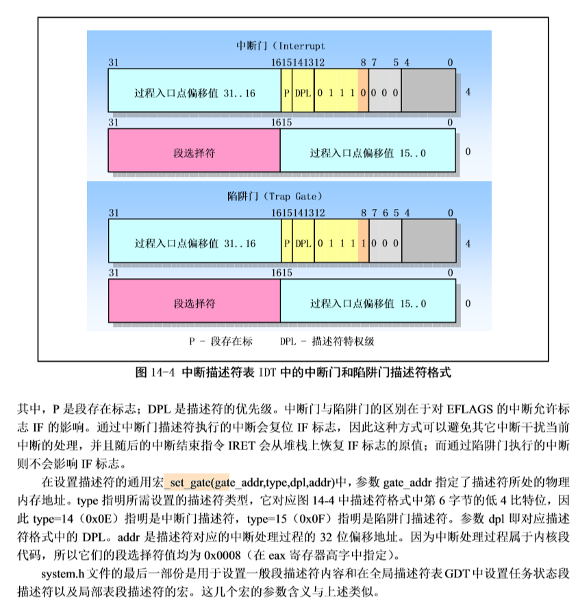
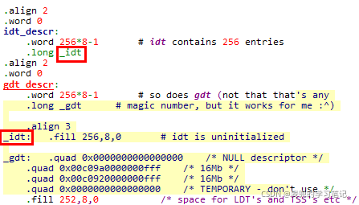
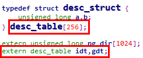
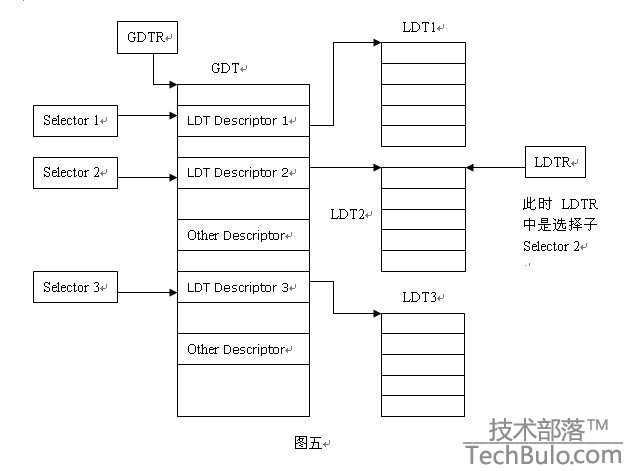
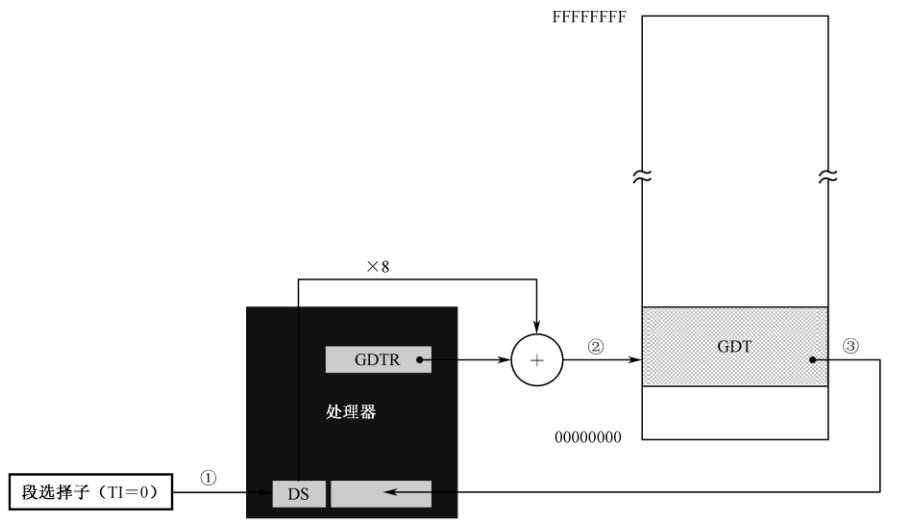

## 课程说明
本实验是 操作系统之基础 - 网易云课堂 的配套实验，推荐大家进行实验之前先学习相关课程：
- L4 操作系统接口
- L5 系统调用的实现
> Tips：点击上方文字中的超链接或者输入 https://mooc.study.163.com/course/1000002004#/info 进入理论课程的学习。 如果网易云上的课程无法查看，也可以看 Bilibili 上的 操作系统哈尔滨工业大学李治军老师。

## 实验目的
- 建立对系统调用接口的深入认识；
- 掌握系统调用的基本过程；
- 能完成系统调用的全面控制；
- 为后续实验做准备。
## 实验内容
此次实验的基本内容是：在 Linux 0.11 上添加两个系统调用，并编写两个简单的应用程序测试它们。

#### （1）iam()
第一个系统调用是 iam()，其原型为：
```
int iam(const char * name);
```
完成的功能是将字符串参数 name 的内容拷贝到内核中保存下来。要求 name 的长度不能超过 23 个字符。返回值是拷贝的字符数。如果 name 的字符个数超过了 23，则返回 “-1”，并置 errno 为 EINVAL。

在 kernal/who.c 中实现此系统调用。

#### （2）whoami()
第二个系统调用是 whoami()，其原型为：
```
int whoami(char* name, unsigned int size);
```
它将内核中由 iam() 保存的名字拷贝到 name 指向的用户地址空间中，同时确保不会对 name 越界访存（name 的大小由 size 说明）。返回值是拷贝的字符数。如果 size 小于需要的空间，则返回“-1”，并置 errno 为 EINVAL。

也是在 kernal/who.c 中实现。

#### （3）测试程序
运行添加过新系统调用的 Linux 0.11，在其环境下编写两个测试程序 iam.c 和 whoami.c。最终的运行结果是：
```
$ ./iam lizhijun

$ ./whoami

lizhijun
```

## 实验提示
首先，请将 Linux 0.11 的源代码恢复到原始状态。
```
# 删除原来的文件
$ cd ~/oslab
$ sudo rm -rf ./*

# 重新拷贝
$ cp -r /home/teacher/oslab/* ./
```
操作系统实现系统调用的基本过程（在 MOOC 课程中已经给出了详细的讲解）是：

- 应用程序调用库函数（API）；
- API 将系统调用号存入 EAX，然后通过中断调用使系统进入内核态；
- 内核中的中断处理函数根据系统调用号，调用对应的内核函数（系统调用）；
- 系统调用完成相应功能，将返回值存入 EAX，返回到中断处理函数；
- 中断处理函数返回到 API 中；
- API 将 EAX 返回给应用程序。

### 应用程序如何调用系统调用
在通常情况下，调用系统调用和调用一个普通的自定义函数在代码上并没有什么区别，但调用后发生的事情有很大不同。

调用自定义函数是通过 call 指令直接跳转到该函数的地址，继续运行。

而调用系统调用，是调用系统库中为该系统调用编写的一个接口函数，叫 API（Application Programming Interface）。API 并不能完成系统调用的真正功能，它要做的是去调用真正的系统调用，过程是：

- 把系统调用的编号存入 EAX；
- 把函数参数存入其它通用寄存器；
- 触发 0x80 号中断（int 0x80）。
linux-0.11 的 lib 目录下有一些已经实现的 API。Linus 编写它们的原因是在内核加载完毕后，会切换到用户模式下，做一些初始化工作，然后启动 shell。而用户模式下的很多工作需要依赖一些系统调用才能完成，因此在内核中实现了这些系统调用的 API。

>后面的目录如果没有特殊说明，都是指在 /home/shiyanlou/oslab/linux-0.11 中。比如下面的 lib/close.c，是指 /home/shiyanlou/oslab/linux-0.11/lib/close.c。

我们不妨看看 lib/close.c，研究一下 close() 的 API：
```
#define __LIBRARY__
#include <unistd.h>

_syscall1(int, close, int, fd)
```
其中 _syscall1 是一个宏，在 include/unistd.h 中定义。
```
#define _syscall1(type,name,atype,a) \
type name(atype a) \
{ \
long __res; \
__asm__ volatile ("int $0x80" \
    : "=a" (__res) \
    : "0" (__NR_##name),"b" ((long)(a))); \
if (__res >= 0) \
    return (type) __res; \
errno = -__res; \
return -1; \
}
```
将 _syscall1(int,close,int,fd) 进行宏展开，可以得到：
```
int close(int fd)
{
    long __res;
    __asm__ volatile ("int $0x80"
        : "=a" (__res)
        : "0" (__NR_close),"b" ((long)(fd)));
    if (__res >= 0)
        return (int) __res;
    errno = -__res;
    return -1;
}
```
这就是 API 的定义。它先将宏 \__NR_close 存入 EAX，将参数 fd 存入 EBX，然后进行 0x80 中断调用。调用返回后，从 EAX 取出返回值，存入 __res，再通过对 __res 的判断决定传给 API 的调用者什么样的返回值。

其中 \__NR_close 就是系统调用的编号，在 include/unistd.h 中定义：
```
#define __NR_close    6
/*
所以添加系统调用时需要修改include/unistd.h文件，
使其包含__NR_whoami和__NR_iam。
*/
```

```
/*
而在应用程序中，要有：
*/

/* 有它，_syscall1 等才有效。详见unistd.h */
#define __LIBRARY__

/* 有它，编译器才能获知自定义的系统调用的编号 */
#include "unistd.h"

/* iam()在用户空间的接口函数 */
_syscall1(int, iam, const char*, name);

/* whoami()在用户空间的接口函数 */
_syscall2(int, whoami,char*,name,unsigned int,size);
```
在 0.11 环境下编译 C 程序，包含的头文件都在 /usr/include 目录下。

该目录下的 unistd.h 是标准头文件（它和 0.11 源码树中的 unistd.h 并不是同一个文件，虽然内容可能相同），没有 \__NR_whoami 和 \__NR_iam 两个宏，需要手工加上它们，也可以直接从修改过的 0.11 源码树中拷贝新的 unistd.h 过来。

### 从“int 0x80”进入内核函数
`int 0x80` 触发后，接下来就是内核的中断处理了。

##### 中断描述符
1. 在X86体系结构的保护模式下，通过中断描述符表IDT组织中断描述符

2. 中断描述符描述的是中断处理程序的入口地址及其属性，根据不同类型，中断描述符可以分为中断门和陷阱门，具体格式如下：



3. 在Linux中，将DPL=3的陷阱门称作系统门, 系统门有如下2个特点

	① 通过系统门（陷阱门）进入中断处理函数时，EFLAGS寄存器的IF位保持不变，也就是不会进行关中断操作

	② 系统门描述符的DPL=3，可以通过用户态触发软中断的门级检查

4. 中断描述符安装在IDT中，他们没有选择子（index + TI + RPL），索引他们的序号（index）就是中断向量


##### linux 0.1.1 中的实现
在内核初始化时，主函数（在 `init/main.c` 中，Linux 实验环境下是 `main()`，Windows 下因编译器兼容性问题被换名为 `start()`）调用了 `sched_init()` 初始化函数：
```
void main(void)
{
//    ……
    time_init();
    sched_init();
    buffer_init(buffer_memory_end);
//    ……
}
```
sched_init() 在 kernel/sched.c 中定义为：
```
void sched_init(void)
{
//    ……
    set_system_gate(0x80,&system_call);
}
```
set_system_gate 是个宏，在 include/asm/system.h 中定义为：
```
#define set_system_gate(n,addr) \
    _set_gate(&idt[n],15,3,addr)
```

_set_gate 的定义是：
```
// gate_addr：要设置的中断描述符地址
 
// type：中断描述符类型，中断门或陷阱门
 
// dpl：中断描述符DPL
 
// addr：中断处理程序地址
 
#define _set_gate(gate_addr,type,dpl,addr) \
__asm__ ("movw %%dx,%%ax\n\t" \
 
        "movw %0,%%dx\n\t" \
 
        "movl %%eax,%1\n\t" \
 
        "movl %%edx,%2" \
 
        : \ // 没有输出部分，只有输入部分
 
        : "i" ((short) (0x8000+(dpl<<13)+(type<<8))), \  // %0操作数
 
        "o" (*((char *) (gate_addr))), \                 // %1操作数
 
        "o" (*(4+(char *) (gate_addr))), \               // %2操作数
 
        "d" ((char *) (addr)),"a" (0x00080000))          // %3和%4操作数
 
 
 
/*
* 输入部分说明
* 0号操作数：约束条件为"i"，表示立即数；中断描述符高4B中的低2B
* 0x8000[P=1]+(dpl<<13)[门描述符特权级级]+(type<<8)[门描述符类型]
* 1号操作数：约束条件为"o"，表示内存单元
* 要设置的中断描述符地址解引用，存放中断描述符低4B，相当于汇编指令中[gate_addr]
* 2号操作数：约束条件为"o"，表示内存单元
* 要设置的中断描述符地址解引用，存放中断描述符高4B，相当于汇编指令中[gete_addr + 4]
* %3号操作数：约束条件为"d"，表示要求使用寄存器edx
* edx = 中断处理程序地址
* %4号操作数：约束条件为"a"，表示要求使用寄存器eax
* eax = 0x00080000，内核代码段选择子
*/
 
 
 
/*
* 组装与安装过程
* 1. movw %%dx, %%ax
* ax = 中断处理程序地址低16位
* 2. movw %0, %%dx
* dx = [P=1] + [门描述符特权级] + [门描述符类型]
* 3. movl %%eax, %1
* [gate_addr] = 中断描述符低4B，内核代码段选择子 + 中断处理程序地址低16位
* 4. movl %%edx, %2
* [gate_addr + 4] = 中断描述符高4B，中断处理程序地址高16位 + [P=1] + [门描述符特权级] + [门描述符类型]
*/
```

说明1：在Linux 0.11中，通过调用_set_gate宏，构成了3个组装和安装中断描述符的宏，分别如下


① set_intr_gate：安装中断门（门类型0b1110），门描述符特权级为0

② set_trap_gate：安装陷阱门（门类型0b1111），门描述符特权级为0

③ set_system_gate：安装系统门（门类型0b1111），门描述符特权级为3

说明2：_set_gate宏中使用的idt变量就是system模块中定义的中断描述符表IDT

① IDT在汇编代码中的定义（head.s）



_idt就是256个中断描述符存储区域的线性地址

② IDT在C代码中的声明（head.h）

idt是一个数组名，也就是数组的首地址，该数组共有256个元素，每个元素8B，这点和中断描述符表的定义是匹配的。

具体细节请参考《注释》的第 14 章。

#### GDT 与 LDT(阅读system_call前必了解)
在CPU中有两个特殊的寄存器，一个为 GDTR ，另一个为 LDTR。在保护模式下，每当用户程序运行时，这两个寄存器的值都被操作系统所赋予，其表示的意义分别为：

**GDTR**： 保存 GDT 表(全局表)的索引。
> 在整个系统中，全局描述符表GDT只有一张(一个处理器对应一个GDT)，GDT可以被放在内存的任何位置，但CPU必须知道GDT的入口，也就是基地址放在哪里，Intel的设计者门提供了一个寄存器GDTR用来存放GDT的入口地址，程序员将GDT设定在内存中某个位置之后，可以通过LGDT指令将GDT的入口地址装入此寄存器，从此以后，CPU就根据此寄存器中的内容作为GDT的入口来访问GDT了。GDTR中存放的是GDT在内存中的基地址和其表长界限。

**LDTR**： 保存 LDT 表(局部表)的索引。
> LDT在PCB中，一个进程对应一个LDT，记录了每个该应用的每个段的起始位置。LDTR是记录当前进程LDT表的位置，切换进程的时候，切换PCB。其实也是切换LDT。

**GDT 与 LDT**的对应关系(可以通过GDT获取到所有的LDT)


#### 段选择符
　实模式下的 6 个段寄存器 CS、 DS、 ES、 FS、 GS 和 SS，在保护模式下叫做段选择器。和实模式不同，保护模式的内存访问有它自己的方式。在保护模式下，尽管访问内存时也需要指定一个段，但传送到段选择器的内容不是逻辑段地址，而是段描述符在描述符表中的索引号。在保护模式下访问一个段时，传送到段选择器的是段选择符，也叫段选择子。其结构如下图所示：


 
 如图所示，段选择子由三部分组成，共16bit，第一部分是描述符的索引号，用来在描述符表中选择一个段描述符。 TI 是描述符表指示器， TI＝0 时，表示描述符在 GDT 中； TI＝1 时，描述符在 LDT 中。RPL 是请求特权级，表示给出当前选择子的那个程序的特权级别，正是该程序要求访问这个内存段。每个程序都有特权级别。
 GDT 的线性基地址在 GDTR 中，又因为每个描述符占 8 字节，因此，描述符在表内的偏移地址是索引号乘以 8。当处理器在执行任何改变段选择器的指令时（比如 pop、 mov、jmp far、 call far、 iret、 retf），就将指令中提供的索引号乘以 8 作为偏移地址，同 GDTR 中提供的线性基地址相加，以访问 GDT。如果没有发现什么问题（比如超出了 GDT 的界限），就自动将找到的描述符加载到不可见的**描述符高速缓存**部分。如下图所示：



  加载的部分包括段的线性基地址、段界限和段的访问属性。此后，每当有访问内存的指令时，就不再访问 GDT 中的描述符，直接用当前段寄存器描述符高速缓存器提供线性基地址。

#### system_call
接下来看 system_call。该函数纯汇编打造，定义在 kernel/system_call.s 中：
```

!……
! # 这是系统调用总数。如果增删了系统调用，必须做相应修改
nr_system_calls = 72
!……

.globl system_call
.align 2
system_call:

! # 检查系统调用编号是否在合法范围内
    cmpl \$nr_system_calls-1,%eax
    ja bad_sys_call
    push %ds
    push %es
    push %fs
    pushl %edx
    pushl %ecx

! # push %ebx,%ecx,%edx，是传递给系统调用的参数
    pushl %ebx

    # 让ds,es指向GDT，指向核心地址空间
    movl $0x10,%edx      
    # 问：0x10 从何而来?
    # 答：0x10是内核数据段 段选择符，因为中断程序属于内核。
    # 由段选择符的结构可知，数据段Index=2，TI=0(表示在GDT中)，RPL=0(处理器的保护机制可识别4个特权级，0级到3级，详见4.5.1 段级保护)，
    # 即得段选择符为： 0000000000010(Index) 0(TI) 00(RPL)，故得16进制为: 0x10
    mov %dx,%ds
    mov %dx,%es
    # 让fs指向的是LDT，指向用户地址空间
    movl $0x17,%edx      
    # 问：0x17是怎么来的？
    # 答：0x17是任务0的数据段选择符。
    # 由段选择符的结构可知，数据段Index=2，TI=1(表示在LDT中)，RPL=3(处理器的保护机制可识别4个特权级，0级到3级，详见4.5.1 段级保护)，
    # 即得段选择符为： 0000000000010(Index) 1(TI) 11(RPL)，故得16进制为: 0x17
    call sys_call_table(,%eax,4)
    pushl %eax
    movl current,%eax
    cmpl $0,state(%eax)
    jne reschedule
    cmpl $0,counter(%eax)
    je reschedule
```
system_call 用 .globl 修饰为其他函数可见。

Windows 实验环境下会看到它有一个下划线前缀，这是不同版本编译器的特质决定的，没有实质区别。

call sys_call_table(,%eax,4) 之前是一些压栈保护，修改段选择子为内核段，call sys_call_table(,%eax,4) 之后是看看是否需要重新调度，这些都与本实验没有直接关系，此处只关心 call sys_call_table(,%eax,4) 这一句。

根据汇编寻址方法它实际上是：call sys_call_table + 4 * %eax，其中 eax 中放的是系统调用号，即 __NR_xxxxxx。

显然，sys_call_table 一定是一个函数指针数组的起始地址，它定义在 include/linux/sys.h 中：

fn_ptr sys_call_table[] = { sys_setup, sys_exit, sys_fork, sys_read,...

增加实验要求的系统调用，需要在这个函数表中增加两个函数引用 ——sys_iam 和 sys_whoami。当然该函数在 sys_call_table 数组中的位置必须和 __NR_xxxxxx 的值对应上。

同时还要仿照此文件中前面各个系统调用的写法，加上：
```
extern int sys_whoami();
extern int sys_iam();
```
不然，编译会出错的。


### 实现 sys_iam() 和 sys_whoami()
添加系统调用的最后一步，是在内核中实现函数 `sys_iam()` 和 `sys_whoami()`。

每个系统调用都有一个 `sys_xxxxxx()` 与之对应，它们都是我们学习和模仿的好对象。

比如在 `fs/open.c` 中的 `sys_close(int fd)`：
```
int sys_close(unsigned int fd)
{
//    ……
    return (0);
}
```
它没有什么特别的，都是实实在在地做 `close()` 该做的事情。

所以只要自己创建一个文件：kernel/who.c，然后实现两个函数就万事大吉了。

如果完全没有实现的思路，不必担心，本实验的 “6.7 在用户态和核心态之间传递数据” 还会有提示。

### 修改 Makefile
要想让我们添加的 `kernel/who.c` 可以和其它 `Linux` 代码编译链接到一起，必须要修改 `Makefile` 文件。

`Makefile` 里记录的是所有源程序文件的编译、链接规则，《注释》3.6 节有简略介绍。我们之所以简单地运行 `make` 就可以编译整个代码树，是因为 `make` 完全按照 `Makefile` 里的指示工作。

如果想要深入学习 `Makefile`，可以选择实验楼的课程： 《Makefile 基础教程》、《跟我一起来玩转 Makefile》。

Makefile 在代码树中有很多，分别负责不同模块的编译工作。我们要修改的是 `kernel/Makefile`。需要修改两处。

（1）第一处
```
OBJS  = sched.o system_call.o traps.o asm.o fork.o \
        panic.o printk.o vsprintf.o sys.o exit.o \
        signal.o mktime.o
```
改为：
```
OBJS  = sched.o system_call.o traps.o asm.o fork.o \
        panic.o printk.o vsprintf.o sys.o exit.o \
        signal.o mktime.o who.o
```
添加了 who.o。

（2）第二处
```
### Dependencies:
exit.s exit.o: exit.c ../include/errno.h ../include/signal.h \
  ../include/sys/types.h ../include/sys/wait.h ../include/linux/sched.h \
  ../include/linux/head.h ../include/linux/fs.h ../include/linux/mm.h \
  ../include/linux/kernel.h ../include/linux/tty.h ../include/termios.h \
  ../include/asm/segment.h
```
改为：
```
### Dependencies:
who.s who.o: who.c ../include/linux/kernel.h ../include/unistd.h
exit.s exit.o: exit.c ../include/errno.h ../include/signal.h \
  ../include/sys/types.h ../include/sys/wait.h ../include/linux/sched.h \
  ../include/linux/head.h ../include/linux/fs.h ../include/linux/mm.h \
  ../include/linux/kernel.h ../include/linux/tty.h ../include/termios.h \
  ../include/asm/segment.h
```
添加了 `who.s who.o: who.c ../include/linux/kernel.h ../include/unistd.h`。

Makefile 修改后，和往常一样 `make all` 就能自动把 `who.c` 加入到内核中了。

如果编译时提示 `who.c` 有错误，就说明修改生效了。所以，有意或无意地制造一两个错误也不完全是坏事，至少能证明 Makefile 是对的。

### 用 printk() 调试内核
oslab 实验环境提供了基于 C 语言和汇编语言的两种调试手段。除此之外，适当地向屏幕输出一些程序运行状态的信息，也是一种很高效、便捷的调试方法，有时甚至是唯一的方法，被称为“printf 法”。

要知道到，`printf()` 是一个只能在用户模式下执行的函数，而系统调用是在内核模式中运行，所以 `printf()` 不可用，要用 `printk()`。

`printk()` 和 `printf()` 的接口和功能基本相同，只是代码上有一点点不同。printk() 需要特别处理一下 fs 寄存器，它是专用于用户模式的段寄存器。

看一看 printk 的代码（在 kernel/printk.c 中）就知道了：
```
int printk(const char *fmt, ...)
{
//    ……
    __asm__("push %%fs\n\t"
            "push %%ds\n\t"
            "pop %%fs\n\t"
            "pushl %0\n\t"
            "pushl $buf\n\t"
            "pushl $0\n\t"
            "call tty_write\n\t"
            "addl $8,%%esp\n\t"
            "popl %0\n\t"
            "pop %%fs"
            ::"r" (i):"ax","cx","dx");
//    ……
}
```
显然，`printk()` 首先 `push %fs` 保存这个指向用户段的寄存器，在最后 `pop %fs` 将其恢复，`printk()` 的核心仍然是调用 `tty_write()`。查看 `printf()` 可以看到，它最终也要落实到这个函数上。

### 在用户态和核心态之间传递数据
指针参数传递的是应用程序所在地址空间的逻辑地址，在内核中如果直接访问这个地址，访问到的是内核空间中的数据，不会是用户空间的。所以这里还需要一点儿特殊工作，才能在内核中从用户空间得到数据。

要实现的两个系统调用参数中都有字符串指针，非常像 `open(char *filename, ……)`，所以我们看一下 `open()` 系统调用是如何处理的。
```
int open(const char * filename, int flag, ...)
{
//    ……
    __asm__("int $0x80"
            :"=a" (res)
            :"0" (__NR_open),"b" (filename),"c" (flag),
            "d" (va_arg(arg,int)));
//    ……
}
```
可以看出，系统调用是用 eax、ebx、ecx、edx 寄存器来传递参数的。

其中 eax 传递了系统调用号，而 ebx、ecx、edx 是用来传递函数的参数的
ebx 对应第一个参数，ecx 对应第二个参数，依此类推。
如 open 所传递的文件名指针是由 ebx 传递的，也即进入内核后，通过 ebx 取出文件名字符串。open 的 ebx 指向的数据在用户空间，而当前执行的是内核空间的代码，如何在用户态和核心态之间传递数据？

接下来我们继续看看 open 的处理：
```
system_call: //所有的系统调用都从system_call开始
!    ……
    # push %ebx,%ecx,%edx，这是传递给系统调用的参数
    pushl %edx
    pushl %ecx
    pushl %ebx                
    # 让ds,es指向GDT，指向核心地址空间
    movl $0x10,%edx      
    # 问：0x10 从何而来?
    # 答：0x10是内核数据段 段选择符，因为中断程序属于内核。
    # 由段选择符的结构可知，数据段Index=2，TI=0(表示在LDT中)，RPL=0(处理器的保护机制可识别4个特权级，0级到3级，详见4.5.1 段级保护)，
    # 即得段选择符为： 0000000000010(Index) 0(TI) 00(RPL)，故得16进制为: 0x10
    mov %dx,%ds
    mov %dx,%es
    # 让fs指向的是LDT，指向用户地址空间
    movl $0x17,%edx      
    # 问：0x17是怎么来的？
    # 答：0x17是任务0的数据段选择符。
    # 由段选择符的结构可知，数据段Index=2，TI=1(表示在GDT中)，RPL=3(处理器的保护机制可识别4个特权级，0级到3级，详见4.5.1 段级保护)，
    # 即得段选择符为： 0000000000010(Index) 1(TI) 11(RPL)，故得16进制为: 0x17
    mov %dx,%fs
    call sys_call_table(,%eax,4)    # 即call sys_open
```
由上面的代码可以看出，获取用户地址空间（用户数据段）中的数据依靠的就是段寄存器 fs，下面该转到 sys_open 执行了，在 fs/open.c 文件中：
```
int sys_open(const char * filename,int flag,int mode)  //filename这些参数从哪里来？
/*是否记得上面的pushl %edx,    pushl %ecx,    pushl %ebx？
  实际上一个C语言函数调用另一个C语言函数时，编译时就是将要
  传递的参数压入栈中（第一个参数最后压，…），然后call …，
  所以汇编程序调用C函数时，需要自己编写这些参数压栈的代码…*/
{
    ……
    if ((i=open_namei(filename,flag,mode,&inode))<0) {
        ……
    }
    ……
}
```
它将参数传给了 open_namei()。

再沿着 open_namei() 继续查找，文件名先后又被传给dir_namei()、get_dir()。

在 get_dir() 中可以看到：
```
static struct m_inode * get_dir(const char * pathname)
{
    ……
    if ((c=get_fs_byte(pathname))=='/') {
        ……
    }
    ……
}
```
处理方法就很显然了：用 `get_fs_byte()` 获得一个字节的用户空间中的数据。

所以，在实现 `iam()` 时，调用 `get_fs_byte()` 即可。

但如何实现 `whoami()` 呢？即如何实现从核心态拷贝数据到用户态内存空间中呢？

猜一猜，是否有 `put_fs_byte()`？有！看一看 `include/asm/segment.h` ：
```
extern inline unsigned char get_fs_byte(const char * addr)
{
    unsigned register char _v;
    __asm__ ("movb %%fs:%1,%0":"=r" (_v):"m" (*addr));
    return _v;
}
```
```
extern inline void put_fs_byte(char val,char *addr)
{
    __asm__ ("movb %0,%%fs:%1"::"r" (val),"m" (*addr));
}
```
他俩以及所有 `put_fs_xxx()` 和 `get_fs_xxx()` 都是用户空间和内核空间之间的桥梁，在后面的实验中还要经常用到。

另外也可以考虑使用`/include/asm/memory.h`里的`memcpy()`方法:

```
/*
 *  NOTE!!! memcpy(dest,src,n) assumes ds=es=normal data segment. This
 *  goes for all kernel functions (ds=es=kernel space, fs=local data,
 *  gs=null), as well as for all well-behaving user programs (ds=es=
 *  user data space). This is NOT a bug, as any user program that changes
 *  es deserves to die if it isn't careful.
 */
#define memcpy(dest,src,n) ({ \
void * _res = dest; \
__asm__ ("cld;rep;movsb" \
	::"D" ((long)(_res)),"S" ((long)(src)),"c" ((long) (n)) \
	); \
_res; \
})
```

### 运行脚本程序
Linux 的一大特色是可以编写功能强大的 shell 脚本，提高工作效率。本实验的部分评分工作由脚本 testlab2.sh 完成。它的功能是测试 iam.c 和 whoami.c。

首先将 iam.c 和 whoami.c 分别编译成 iam 和 whoami，然后将 testlab2.sh（在 /home/teacher 目录下） 拷贝到同一目录下。

用下面命令为此脚本增加执行权限：
```
$ chmod +x testlab2.sh
```
然后运行之：
```
$ ./testlab2.sh
```
根据输出，可知 iam.c 和 whoami.c 的得分。

##### errno
errno 是一种传统的错误代码返回机制。

当一个函数调用出错时，通常会返回 -1 给调用者。但 -1 只能说明出错，不能说明错是什么。为解决此问题，全局变量 errno 登场了。错误值被存放到 errno 中，于是调用者就可以通过判断 errno 来决定如何应对错误了。

各种系统对 errno 的值的含义都有标准定义。Linux 下用“man errno”可以看到这些定义。
