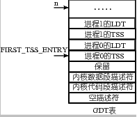
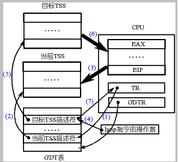

# 基于内核栈切换的进程切换
## 课程说明
本实验是 操作系统之进程与线程 - 网易云课堂 的配套实验，推荐大家进行实验之前先学习相关课程：

- L10 用户级线程
- L11 内核级线程
- L12 核心级线程实现实例
- L13 操作系统的那棵树

> Tips：点击上方文字中的超链接或者输入 https://mooc.study.163.com/course/1000002008#/info 进入理论课程的学习。 如果网易云上的课程无法查看，也可以看 Bilibili 上的 操作系统哈尔滨工业大学李治军老师。

## 实验目的
- 深入理解进程和进程切换的概念；
- 综合应用进程、CPU 管理、PCB、LDT、内核栈、内核态等知识解决实际问题；
- 开始建立系统认识。

## 实验内容
现在的 Linux 0.11 采用 TSS（后面会有详细论述）和一条指令就能完成任务切换，虽然简单，但这指令的执行时间却很长，在实现任务切换时大概需要 200 多个时钟周期。

而通过堆栈实现任务切换可能要更快，而且采用堆栈的切换还可以使用指令流水的并行优化技术，同时又使得 CPU 的设计变得简单。所以无论是 Linux 还是 Windows，进程/线程的切换都没有使用 Intel 提供的这种 TSS 切换手段，而都是通过堆栈实现的。

本次实践项目就是将 Linux 0.11 中采用的 TSS 切换部分去掉，取而代之的是基于堆栈的切换程序。具体的说，就是将 Linux 0.11 中的 switch_to 实现去掉，写成一段基于堆栈切换的代码。

本次实验包括如下内容：

- 编写汇编程序 switch_to：
- 完成主体框架；
- 在主体框架下依次完成 PCB 切换、内核栈切换、LDT 切换等；
- 修改 fork()，由于是基于内核栈的切换，所以进程需要创建出能完成内核栈切换的样子。
- 修改 PCB，即 task_struct 结构，增加相应的内容域，同时处理由于修改了 task_struct 所造成的影响。
- 用修改后的 Linux 0.11 仍然可以启动、可以正常使用。
- （选做）分析实验 3 的日志体会修改前后系统运行的差别。
## 实验提示
本次实验将 Linux 0.11 中采用的 TSS 切换部分去掉，取而代之的是基于堆栈的切换程序。具体的说，就是将 Linux 0.11 中的 switch_to （在 kernal/system_call.s 中）实现去掉，写成一段基于堆栈切换的代码。
### TSS 切换
在现在的 Linux 0.11 中，真正完成进程切换是依靠任务状态段（Task State Segment，简称 TSS）的切换来完成的。

具体的说，在设计“Intel 架构”（即 x86 系统结构）时，每个任务（进程或线程）都对应一个独立的 TSS，TSS 就是内存中的一个结构体，里面包含了几乎所有的 CPU 寄存器的映像。有一个任务寄存器（Task Register，简称 TR）指向当前进程对应的 TSS 结构体，所谓的 TSS 切换就将 CPU 中几乎所有的寄存器都复制到 TR 指向的那个 TSS 结构体中保存起来，同时找到一个目标 TSS，即要切换到的下一个进程对应的 TSS，将其中存放的寄存器映像“扣在” CPU 上，就完成了执行现场的切换，如下图所示。

图 1 基于 TSS 的进程切换
Intel 架构不仅提供了 TSS 来实现任务切换，而且只要一条指令就能完成这样的切换，即图中的 ljmp 指令。

具体的工作过程是：

（1）首先用 TR 中存取的段选择符在 GDT 表中找到当前 TSS 的内存位置，由于 TSS 是一个段，所以需要用段表中的一个描述符来表示这个段，和在系统启动时论述的内核代码段是一样的，那个段用 GDT 中的某个表项来描述，还记得是哪项吗？是 8 对应的第 1 项。此处的 TSS 也是用 GDT 中的某个表项描述，而 TR 寄存器是用来表示这个段用 GDT 表中的哪一项来描述，所以 TR 和 CS、DS 等寄存器的功能是完全类似的。
（2）找到了当前的 TSS 段（就是一段内存区域）以后，将 CPU 中的寄存器映像存放到这段内存区域中，即拍了一个快照。
（3）存放了当前进程的执行现场以后，接下来要找到目标进程的现场，并将其扣在 CPU 上，找目标 TSS 段的方法也是一样的，因为找段都要从一个描述符表中找，描述 TSS 的描述符放在 GDT 表中，所以找目标 TSS 段也要靠 GDT 表，当然只要给出目标 TSS 段对应的描述符在 GDT 表中存放的位置——段选择子就可以了，仔细想想系统启动时那条著名的 jmpi 0, 8 指令，这个段选择子就放在 ljmp 的参数中，实际上就 jmpi 0, 8 中的 8。
（4）一旦将目标 TSS 中的全部寄存器映像扣在 CPU 上，就相当于切换到了目标进程的执行现场了，因为那里有目标进程停下时的 CS:EIP，所以此时就开始从目标进程停下时的那个 CS:EIP 处开始执行，现在目标进程就变成了当前进程，所以 TR 需要修改为目标 TSS 段在 GDT 表中的段描述符所在的位置，因为 TR 总是指向当前 TSS 段的段描述符所在的位置。
上面给出的这些工作都是一句长跳转指令 ljmp 段选择子:段内偏移，在段选择子指向的段描述符是 TSS 段时 CPU 解释执行的结果，所以基于 TSS 进行进程/线程切换的 switch_to 实际上就是一句 ljmp 指令：

#define switch_to(n) {
    struct{long a,b;} tmp;
    __asm__(
        "movw %%dx,%1"
        "ljmp %0" ::"m"(*&tmp.a), "m"(*&tmp.b), "d"(TSS(n)
    )
 }

#define FIRST_TSS_ENTRY 4

#define TSS(n) (((unsigned long) n) << 4) + (FIRST_TSS_ENTRY << 3))
copy
GDT 表的结构如下图所示，所以第一个 TSS 表项，即 0 号进程的 TSS 表项在第 4 个位置上，4<<3，即 4 * 8，相当于 TSS 在 GDT 表中开始的位置，TSS（n）找到的是进程 n 的 TSS 位置，所以还要再加上 n<<4，即 n * 16，因为每个进程对应有 1 个 TSS 和 1 个 LDT，每个描述符的长度都是 8 个字节，所以是乘以 16，其中 LDT 的作用就是上面论述的那个映射表，关于这个表的详细论述要等到内存管理一章。TSS(n) = n * 16 + 4 * 8，得到就是进程 n（切换到的目标进程）的 TSS 选择子，将这个值放到 dx 寄存器中，并且又放置到结构体 tmp 中 32 位长整数 b 的前 16 位，现在 64 位 tmp 中的内容是前 32 位为空，这个 32 位数字是段内偏移，就是 jmpi 0, 8 中的 0；接下来的 16 位是 n * 16 + 4 * 8，这个数字是段选择子，就是 jmpi 0, 8 中的 8，再接下来的 16 位也为空。所以 swith_to 的核心实际上就是 ljmp 空, n*16+4*8，现在和前面给出的基于 TSS 的进程切换联系在一起了。

图 2 GDT 表中的内容

