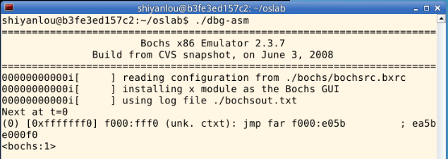
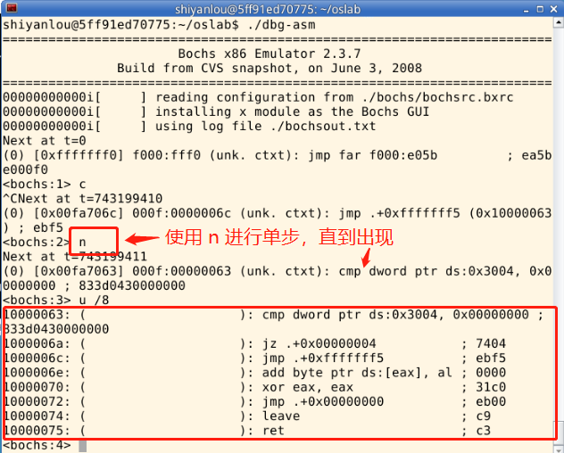

# 地址映射与共享
## 课程说明

本实验是 操作系统之内存管理 - 网易云课堂 的配套实验，推荐大家进行实验之前先学习相关课程：

- L20 内存使用与分段
- L21 内存分区与分页
- L22 段页结合的实际内存管理
- L23 请求调页内存换入
- L24 内存换出

> Tips：点击上方文字中的超链接或者输入 https://mooc.study.163.com/course/1000003007#/info 进入理论课程的学习。 如果网易云上的课程无法查看，也可以看 Bilibili 上的 操作系统哈尔滨工业大学李治军老师。

## 实验目的
- 深入理解操作系统的段、页式内存管理，深入理解段表、页表、逻辑地址、线性地址、物理地址等概念；
- 实践段、页式内存管理的地址映射过程；
- 编程实现段、页式内存管理上的内存共享，从而深入理解操作系统的内存管理。

## 实验内容
本次实验的基本内容是：

- 用 Bochs 调试工具跟踪 Linux 0.11 的地址翻译（地址映射）过程，了解 IA-32 和 Linux 0.11 的内存管理机制；
- 在 Ubuntu 上编写多进程的生产者—消费者程序，用共享内存做缓冲区；
- 在信号量实验的基础上，为 Linux 0.11 增加共享内存功能，并将生产者—消费者程序移植到 Linux 0.11。

### 跟踪地址翻译过程
首先以汇编级调试的方式启动 Bochs，引导 Linux 0.11，在 0.11 下编译和运行 test.c。它是一个无限循环的程序，永远不会主动退出。然后在调试器中通过查看各项系统参数，从逻辑地址、LDT 表、GDT 表、线性地址到页表，计算出变量 i 的物理地址。最后通过直接修改物理内存的方式让 test.c 退出运行。

test.c 的代码如下：
```c
#include <stdio.h>

int i = 0x12345678;
int main(void)
{
    printf("The logical/virtual address of i is 0x%08x", &i);
    fflush(stdout);
    while (i)
        ;
    return 0;
}
```
### 基于共享内存的生产者—消费者程序
本项实验在 Ubuntu 下完成，与信号量实验中的 pc.c 的功能要求基本一致，仅有两点不同：

- 不用文件做缓冲区，而是使用共享内存；
- 生产者和消费者分别是不同的程序。生产者是 `producer.c`，消费者是 `consumer.c`。两个程序都是单进程的，通过信号量和缓冲区进行通信。

Linux 下，可以通过 `shmget()` 和 `shmat()` 两个系统调用使用共享内存。

### 共享内存的实现
进程之间可以通过页共享进行通信，被共享的页叫做共享内存，结构如下图所示：


 
本部分实验内容是在 Linux 0.11 上实现上述页面共享，并将上一部分实现的 `producer.c` 和 `consumer.c` 移植过来，验证页面共享的有效性。

具体要求在 `mm/shm.c` 中实现 `shmget()` 和 `shmat()` 两个系统调用。它们能支持 `producer.c` 和 `consumer.c` 的运行即可，不需要完整地实现 POSIX 所规定的功能。
```c
shmget()
int shmget(key_t key, size_t size, int shmflg);
```

`shmget()` 会新建/打开一页内存，并返回该页共享内存的 `shmid`（该块共享内存在操作系统内部的 `id`）。

所有使用同一块共享内存的进程都要使用相同的 `key` 参数。

如果`key` 所对应的共享内存已经建立，则直接返回 `shmid`。如果 `size` 超过一页内存的大小，返回 `-1`，并置 `errno` 为 `EINVAL`。如果系统无空闲内存，返回 `-1`，并置 `errno` 为 `ENOMEM`。

`shmflg` 参数可忽略。
```c
shmat()
void *shmat(int shmid, const void *shmaddr, int shmflg);
```
`shmat()` 会将 shmid 指定的共享页面映射到当前进程的虚拟地址空间中，并将其首地址返回。

如果 `shmid` 非法，返回 `-1`，并置 `errno` 为 `EINVAL`。

`shmaddr` 和 `shmflg` 参数可忽略。

## 实验提示
本次需要完成的内容：

（1）用 Bochs 调试工具跟踪 Linux 0.11 的地址翻译（地址映射）过程，了解 IA-32 和 Linux 0.11 的内存管理机制；

（2）在 Ubuntu 上编写多进程的生产者—消费者程序，用共享内存做缓冲区；

（3）在信号量实验的基础上，为 Linux 0.11 增加共享内存功能，并将生产者—消费者程序移植到 Linux 0.11。

### IA-32 的地址翻译过程
Linux 0.11 完全遵循 IA-32（Intel Architecture 32-bit）架构进行地址翻译，Windows、后续版本的 Linux 以及一切在 IA-32 保护模式下运行的操作系统都遵循此架构。因为只有这样才能充分发挥 CPU 的 `MMU（内存管理单元）` 的功能。

关于此地址翻译过程的细节，请参考《注释》一书中的 5.3.1-5.3.4 节。

### 用 Bochs 汇编级调试功能进行人工地址翻译
此过程比较机械，基本不消耗脑细胞，做一下有很多好处。

（1）准备
编译好 Linux 0.11 后，首先通过运行 `./dbg-asm` 启动调试器，此时 Bochs 的窗口处于黑屏状态


而命令行窗口显示：



```shell
========================================================================
                       Bochs x86 Emulator 2.3.7
               Build from CVS snapshot, on June 3, 2008
========================================================================
00000000000i[     ] reading configuration from ./bochs/bochsrc.bxrc
00000000000i[     ] installing x module as the Bochs GUI
00000000000i[     ] using log file ./bochsout.txt
Next at t=0
(0) [0xfffffff0] f000:fff0 (unk. ctxt): jmp far f000:e05b         ; ea5be000f0
<bochs:1>_
```
`Next at t=0` 表示下面的指令是 Bochs 启动后要执行的第一条软件指令。

单步跟踪进去就能看到 BIOS 的代码。不过这不是本实验需要的。直接输入命令 `c`，continue 程序的运行，Bochs 一如既往地启动了 Linux 0.11。

在 Linux 0.11 下输入（或拷入）`test.c`（代码在本实验的第 3 小节中），编译为 `test`，运行之，打印如下信息：
```
The logical/virtual address of i is 0x00003004
```
只要 `test` 不变，`0x00003004` 这个值在任何人的机器上都是一样的。即使在同一个机器上多次运行 `test`，也是一样的。

`test` 是一个死循环，只会不停占用 CPU，不会退出。

（2）暂停
当 `test` 运行的时候，在命令行窗口按 `Ctrl+c`，Bochs 会暂停运行，进入调试状态。绝大多数情况下都会停在 `test` 内，显示类似如下信息：
```
(0) [0x00fc8031] 000f:00000031 (unk. ctxt): cmp dword ptr ds:0x3004, 0x00000000 ; 833d0430000000
```
其中的 `000f` 如果是 `0008`，则说明中断在了内核里。那么就要 `c`，然后再 `ctrl+c`，直到变为 `000f` 为止。

如果显示的下一条指令不是 `cmp ...`（这里指语句以 `cmp` 开头），就用 `n` 命令单步运行几步，直到停在 `cmp ...`。

使用命令 `u /8`，显示从当前位置开始 8 条指令的反汇编代码，结构如下：



```shell
<bochs:3> u /8
10000063: (                    ): cmp dword ptr ds:0x3004, 0x00000000 ; 833d0430000000
1000006a: (                    ): jz .+0x00000004           ; 7404
1000006c: (                    ): jmp .+0xfffffff5          ; ebf5
1000006e: (                    ): add byte ptr ds:[eax], al ; 0000
10000070: (                    ): xor eax, eax              ; 31c0
10000072: (                    ): jmp .+0x00000000          ; eb00
10000074: (                    ): leave                     ; c9
10000075: (                    ): ret                       ; c3
```
这就是 `test.c` 中从 `while` 开始一直到 `return` 的汇编代码。变量 `i` 保存在 `ds:0x3004` 这个地址，并不停地和 `0` 进行比较，直到它为 `0`，才会跳出循环。

现在，开始寻找 `ds:0x3004` 对应的物理地址。

