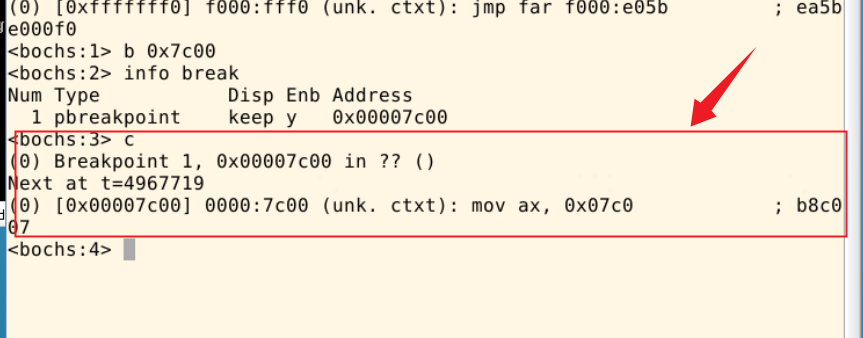

## ASM调试

### 开始asm调试
汇编级调试需要执行命令：
```
# 确认在 oslab 目录下
$ cd ~/oslab/

# 运行脚本前确定已经关闭刚刚运行的 Bochs
$ ./dbg-asm
```
> 汇编级调试的启动之后 Bochs 是黑屏，这是正常的。
### 常用命令介绍
#### 设置断点`b`
> 格式: b 内存地址

如: b 0x7c00，在线性地址0x7c00处设置断点。

##### 示例

#### 查看设置过的断点`info break`
> 格式：info break 

##### 示例

#### 继续执行`c`
> 格式： c
##### 示例

#### 执行下一行代码`n`
> 格式： n

它和单步执行类似，单步执行遇到循环和函数时会跳转到内部，而n命令会执行完循环和函数，类似于step over，这样在遇到大量的循环或者较长的函数时，可以用n命令来执行到下一行。

n命令能跳转到下一行是因为loop或者call执行有明显的结束标记（前者通过cx寄存器，后者通ret指令），如果遇到用jmp语句写的循环这种情况，没有明显结束标记的，可以用下面的u命令反汇编代码的地址，找到循环的下一行指令的地址，然后给该地址加一个断点就能达到同样的效果。
##### 示例

#### 反编译`u`
> 格式: u /20 0x7c00 或者 u
直接使用u命令会反汇编当前执行的指令，它可以加参数， u /反汇编数量 起始地址 ，如 u /20 0x7c00 就是从0x7c00处开始，反汇编20条指令，如果没有起始地址就是从当前地址开始。

它还可以反汇编一个范围的代码，u 起始地址 结束地址 ，如u 0x7c00 0x7cff 就是反汇编0x7c00到0x7cff的代码。
##### 示例

#### 查看内存`xp`
> 格式: xp /nuf 地址 查看物理地址处的内存内容。
```
n 指定要显示的内存单元的数量
u 显示的内存单元的大小，如下参数之一
	b 单个字节
	h 半个字(2 字节)
	w 一个字(4 字节)
f 打印的格式。如下类型之一：
	x 按照十六进制形式打印
	d 按照十进制形式打印
	u 以无符号的10进制打印
	o 按照八进制形式打印
	t 按照二进制形式打印
  c 按照字符制形式打印
```
##### 示例

#### 查看寄存器`r`
汇编代码中，调试最常用的功能就是查看寄存器的内容。
```
r 查看通用寄存器
sreg 查看段寄存器
creg 查看控制寄存器
dreg 查看调试寄存器
info cpu 查看所有寄存器
```
##### 示例

### help如何使用
可以用命令 help 来查看调试系统用的基本命令。更详细的信息请查阅 Bochs 使用手册。


### 不错的博客
- [Bochs调试常用命令](https://petpwiuta.github.io/2020/05/09/Bochs%E8%B0%83%E8%AF%95%E5%B8%B8%E7%94%A8%E5%91%BD%E4%BB%A4/)
