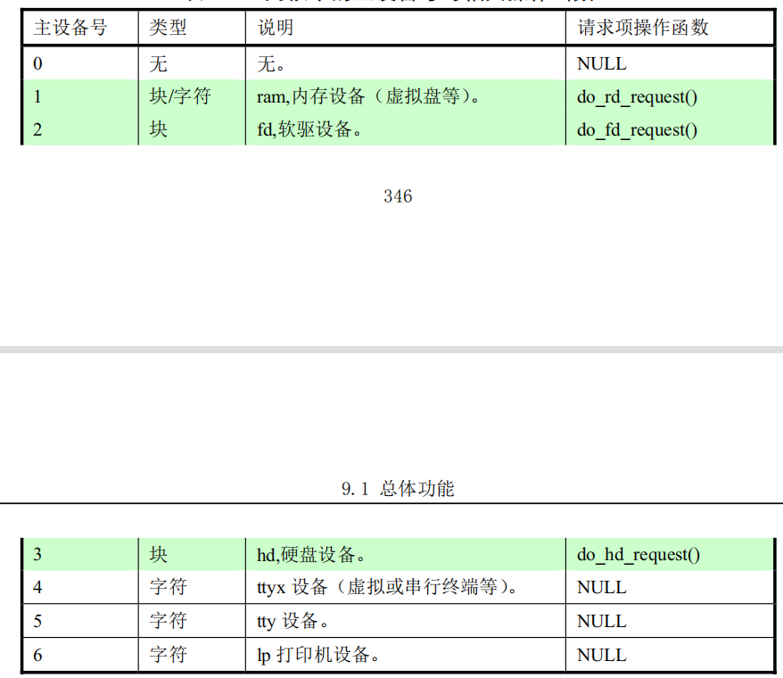
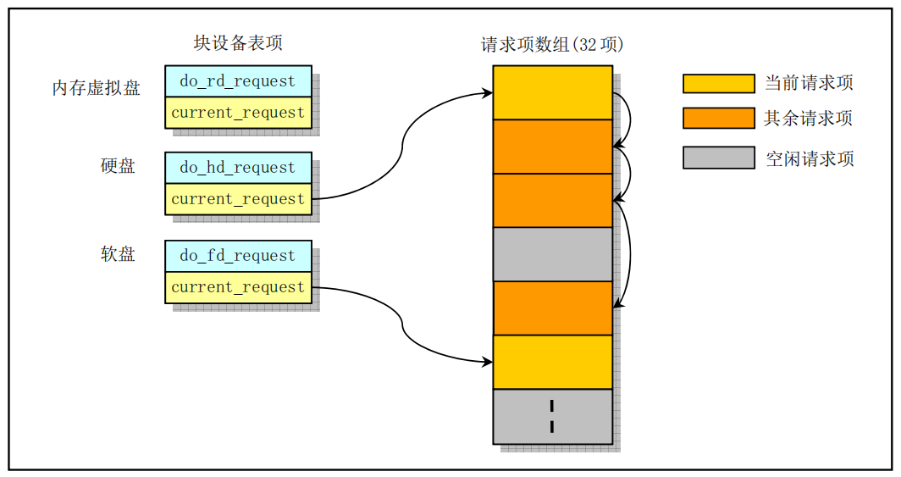

# 块设备驱动程序(block driver)

> 块设备是一种可以**以固定大小的数据块为单位进行寻址和访问的设备**,例如硬盘设备和软盘设备。Linux  0.11 内核主要支持硬盘、软盘和内存虚拟盘三种块设备。

## 总体功能

对硬盘和软盘块设备上数据的读写操作是通过中断处理程序进行的。内核每次读写的数据量以一个 逻辑块(1024 字节)为单位,而块设备控制器则是以扇区(512 字节)为单位。在处理过程中,使用了读写请求项等待队列来顺序缓冲一次读写多个逻辑块的操作。

当程序需要读取硬盘上的一个逻辑块时,就会向缓冲区管理程序提出申请,而**程序的进程则进入睡眠等待状态**。缓冲区管理程序**首先在缓冲区中寻找以前是否已经读取过这块数据**。**如果缓冲区中已经有了,就直接将对应的缓冲区块头指针返回给程序并唤醒该程序进程**。**若缓冲区中还不存在所要求的数据块,则缓冲管理程序就会调用本章中的低级块读写函数 `ll_rw_block()`,向相应的块设备驱动程序发出一个读数据块的操作请求**。该函数会为此创建一个请求结构项,并插入请求队列中。为了提供读写磁盘的效率,减小磁头移动的距离,在插入请求项时使用了**电梯移动算法**。

**此时,若对应块设备的请求项队列为空,则表明此刻该块设备不忙。于是内核就会立刻向该块设备 的控制器发出读数据命令。当块设备的控制器将数据读入到指定的缓冲块中后, 就会发出中断请求信号, 并调用相应的读命令后处理函数,处理继续读扇区操作或者结束本次请求项的过程。例如对相应块设备进行关闭操作和设置该缓冲块数据已经更新标志,最后唤醒等待该块数据的进程**。

### 块设备请求项和请求队列
根据上面描述,我们知道低级读写函数 `ll_rw_block()`是通过**请求项**来与各种块设备建立联系并发出 读写请求。对于各种块设备, 内核使用了一张块设备表 `blk_dev[]`来进行管理。每种块设备都在块设备表 中占有一项。块设备表中每个块设备项的结构为(摘自 `kernel/blk_drv/blk.h`)。
```c
struct blk_dev_struct {
	void (*request_fn)(void);             //请求项操作的函数指针
	struct request * current_request;     //当前请求项指针。
};

extern struct blk_dev_struct blk_dev[NR_BLK_DEV];   //块设备表(数组)(NR_BLK_DEV=7)。
```

其中:

- **第一个字段是一个函数指针**,用于操作相应块设备的请求项。例如,对于硬盘驱动程序,它是 `do_hd_request()`,而对于软盘设备,它就是 `do_floppy_request()`。
- **第二个字段是当前请求项结构指针**,用于指明本块设备目前正在处理的请求项,初始化时都被置成 `NULL`。

块设备表将在内核初始化时, 在 `init/main.c` 程序调用各设备的初始化函数时被设置。为了便于扩展, Linus 把块设备表建成了一个以主设备号为索引的数组。在 Linux 0.11 中, 主设备号有 7 种, 见下表。其中, 主设备号 1、2 和 3 分别对应块设备: 虚拟盘、软盘和硬盘。在块设备数组中其他各项都被默认地置成 `NULL`。



当内核发出一个块设备读写或其他操作请求时,`ll_rw_block()`函数即会根据其参数中指明的操作命令 和数据缓冲块头中的设备号, 利用对应的请求项操作函数 `do_XX_request()`建立一个块设备请求项(函数名中的'XX'可以是'rd' 、'fd'或'hd', 分别代表内存、软盘和硬盘块设备), 并利用电梯算法插入到请求项队列中。请求项队列由请求项数组中的项构成,共有 32 项, 每个请求项的数据结构如下所示:
```c
struct request {
	int dev;				//使用的设备号(若为-1, 表示该项空闲)
	int cmd;				//命令(READ 或 WRITE)。
	int errors;				//操作时产生的错误次数
	unsigned long sector;			//起始扇区。(1 块=2 扇区)
	unsigned long nr_sectors;		//读/写扇区数。
	char * buffer;				//数据缓冲区。
	struct task_struct * waiting;		//等待操作执行完成的任务
	struct buffer_head * bh;		//缓冲区头指针(inblucd/linux/fs.h,68)。 
	struct request * next;			//指向下一请求项。
};

extern struct request request[NR_REQUEST];	//请求项数组(NR_REQUEST=32)
```
每个块设备的当前请求指针与请求项数组中该设备的请求项链表共同构成了该设备的请求队列。项与项之间利用字段 `next` 指针形成链表。因此块设备项和相关的请求队列形成如下图所示结构。请求项采用数组加链表结构的主要原因是为了满足两个目的：

- 一是利用请求项的数组结构在搜索空闲请求块时 可以进行循环操作,搜索访问时间复杂度为常数,因此程序可以编制得很简洁﹔
- 二是为满足电梯算法(Elevator Algorithm) 插入请求项操作, 因此也需要采用链表结构。
 
下图中示出了硬盘设备当前具有 4 个请求项,软盘设备具有 1 个请求项,而虚拟盘设备目前暂时没有读写请求项。



对于一个当前空闲的块设备,当 `ll_rw_block()` 函数为其建立第一个请求项时,会让该设备的当前请求项指针 `current_request` 直接指向刚建立的请求项,并且立刻调用对应设备的请求项操作函数开始执行 块设备读写操作。当一个块设备已经有几个请求项组成的链表存在, `ll_rw_block()`就会利用电梯算法, 根据磁头移动距离最小原则,把新建的请求项插入到链表适当的位置处。

另外,为满足读操作的优先权,在为建立新的请求项而搜索请求项数组时,把建立写操作时的空闲 项搜索范围限制在整个请求项数组的前 2/3 范围内, 而剩下的 1/3 请求项专门给读操作建立请求项使用。

### 块设备访问调度处理


## 与文件系统的关系

## 块设备驱动程序子目录 `kernel/blk_drv`

通常情况下,用户是通过文件系统来访问设备的,因此设备驱动程序为文件系统实现了调用接口。 在使用块设备时,由于其数据吞吐量大,为了能够高效率地使用块设备上的数据,在用户进程与块设备 之间使用了高速缓冲机制。在访问块设备上的数据时,系统首先以数据块的形式把块设备上的数据读入 到高速缓冲区中,然后再提供给用户。 `blk_drv` 子目录共包含 4 个 c 文件和 1 个头文件。头文件 `blk.h` 由 于是块设备程序专用的,所以与 C 文件放在一起。这几个文件之间的大致关系,见下图所示。


`blk.h` 中定义了 3 个 C 程序中共用的块设备结构和数据块请求结构。`hd.c` 程序主要实现对硬盘数据块 进行读/写的底层驱动函数, 主要是 `do_hd__request()`函数﹔ `floppy.c` 程序中主要实现了对软盘数据块的读 / 写驱动函数,主要是 `do_fd_request()` 函数。 `ll_rw_blk.c`  中程序实现了低层块设备数据读/ 写函数 `ll_rw_block()`, 内核中所有其他程序都是通过该函数对块设备进行数据读写操作。你将看到该函数在许多 访问块设备数据的地方被调用,尤其是在高速缓冲区处理文件 `fs/buffer.c` 中。


## 这块根据 Linux 0.11 的第9章 块驱动写
