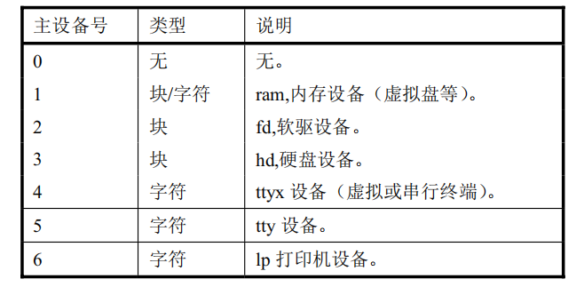

# 设备管理
## 计算机组成原理层面
> 北京大学 《计算机组成》 陆俊林 —— 9.1 - 9.6

https://www.bilibili.com/video/BV1VE411o7nx?p=52&vd_source=afbe39567defad401c79f6fbb57691cf

## 操作系统层面
操作系统的主要功能之一就是与周边的输入输出设备进行通信,采用统一的接口来控制这些外围设 备。操作系统的所有设备可以粗略地分成两种类型：块设备(block device)和字符型设备(character device)。 

- 块设备：是一种可以以固定大小的数据块为单位**进行寻址和访问**的设备,例如硬盘设备和软盘设备。
- 字符设备：是一种以字符流作为操作对象的设备,**不能进行寻址操作**。例如打印机设备、网络接口设备和终端设备。

为了便于管理和访问,操作系统将这些设备统一地以设备号进行分类。在 Linux 0.11 内核中设备 被分成 7 类,即共有 7 个设备号(0 到6)。每个类型中的设备可再根据子(从、次)设备号来加以进一 步区别。下表中列出了各个设备号的设备类型和相关的设备。从表中可以看出某些设备(内存设备)  既可以作为块设备也可以作为字符设备进行访问。



## 设备的读与写
在`Linux`中，**一切皆文件**。故和文件读写一样，设备的读写也被包含在系统调用`sys_read`和`sys_write`中。其具体源码分析如下：
### 源码分析
在`include/linux/sys.h`中指定`sys_read`为4号系统调用,`sys_write`为5号系统调用：

```c
/* ... 省略其他代码 */
extern int sys_read();
extern int sys_write();
/* ... 省略其他代码 */

fn_ptr sys_call_table[] = { sys_setup, sys_exit, sys_fork, sys_read,
sys_write, /* ... 省略其他代码 */ }
```

`sys_read()`在`fs/read_write.c`中，其具体调用设备相对应的驱动函数：

```c
/* ... 省略其他代码 */

int sys_read(unsigned int fd,char * buf,int count)
{
	struct file * file;
	struct m_inode * inode;

	if (fd>=NR_OPEN || count<0 || !(file=current->filp[fd]))
		return -EINVAL;
	if (!count)
		return 0;
	verify_area(buf,count);
	inode = file->f_inode;
	if (inode->i_pipe)
		return (file->f_mode&1)?read_pipe(inode,buf,count):-EIO;
	if (S_ISCHR(inode->i_mode))
		return rw_char(READ,inode->i_zone[0],buf,count,&file->f_pos);   //调用字符设备读
	if (S_ISBLK(inode->i_mode))
		return block_read(inode->i_zone[0],&file->f_pos,buf,count);     //调用块设备读
	if (S_ISDIR(inode->i_mode) || S_ISREG(inode->i_mode)) {
		if (count+file->f_pos > inode->i_size)
			count = inode->i_size - file->f_pos;
		if (count<=0)
			return 0;
		return file_read(inode,file,buf,count);
	}
	printk("(Read)inode->i_mode=%06o\n\r",inode->i_mode);
	return -EINVAL;
}
```

`sys_write()`在`fs/read_write.c`中，其具体调用设备相对应的驱动函数：

```c
/* ... 省略其他代码 */

int sys_write(unsigned int fd,char * buf,int count)
{
	struct file * file;
	struct m_inode * inode;
	
	if (fd>=NR_OPEN || count <0 || !(file=current->filp[fd]))
		return -EINVAL;
	if (!count)
		return 0;
	inode=file->f_inode;
	if (inode->i_pipe)
		return (file->f_mode&2)?write_pipe(inode,buf,count):-EIO;
	if (S_ISCHR(inode->i_mode))
		return rw_char(WRITE,inode->i_zone[0],buf,count,&file->f_pos);    //调用字符设备写
	if (S_ISBLK(inode->i_mode))
		return block_write(inode->i_zone[0],&file->f_pos,buf,count);      //调用块设备写
	if (S_ISREG(inode->i_mode))
		return file_write(inode,file,buf,count);
	printk("(Write)inode->i_mode=%06o\n\r",inode->i_mode);
	return -EINVAL;
}

/* ... 省略其他代码 */
```

## 字符设备驱动程序(char device)
[点击跳转](https://github.com/lcdzhao/operating_system/tree/master/theory/5.%20%E8%AE%BE%E5%A4%87%E7%AE%A1%E7%90%86/1.%20%E5%AD%97%E7%AC%A6%E8%AE%BE%E5%A4%87%E9%A9%B1%E5%8A%A8%E7%A8%8B%E5%BA%8F(char%20device))
## 块设备驱动程序(block driver)
[点击跳转](https://github.com/lcdzhao/operating_system/tree/master/theory/5.%20%E8%AE%BE%E5%A4%87%E7%AE%A1%E7%90%86/2.%20%E5%9D%97%E8%AE%BE%E5%A4%87%E9%A9%B1%E5%8A%A8%E7%A8%8B%E5%BA%8F(block%20driver))

