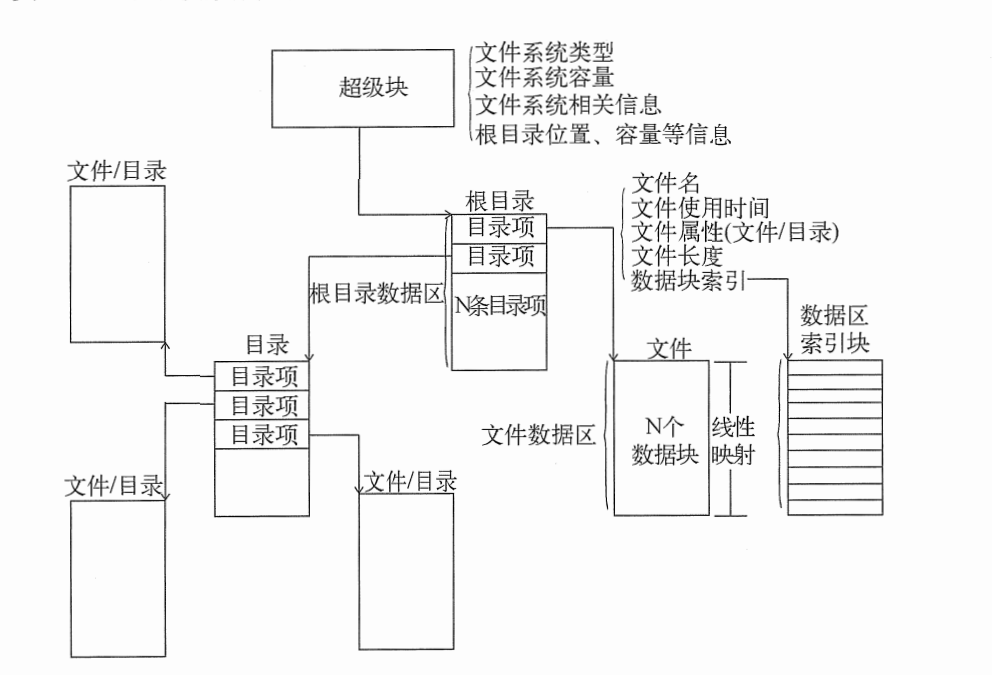

# 文件系统概述
> 内容来自《一个64位操作系统的设计与实现》

## 历史
在没有文件这一概念之前，存储介质的容量极小，**数据往往独占存储设备并连续保存在其中**。随着存储设备容量的急剧增长，它们已经有能力同时为多个设备提供数据存储空间。随着数据的持续增长，存储介质为设备划分的数据存储空间会产生数据覆盖或空间划分不合理等现象，因此才会使用文件和文件系统来解决此类现象。
文件是一个抽象的概念，它有组织地将多个数据块管理起来，以确保有足够的存储空间容纳数据。

## 文件系统组成
一个文件通常由文件信息和数据两部分组成，其中的文件信息记录着文件的使用时间、文件名、文件长度、数据扇区索引等内容，而数据区则记录着文件保存的实际数据。当文件的个数达到一定数量级后，管理文件就变成一件非常复杂的事情，如果借助文件系统来管理文件可使问题变得简单许多。
文件系统通常会包含超级块、目录项、数据区三部分，它们各司其职将所有文件有组织地管理起来，在逻辑上呈现出多叉的树状结构，图13-1是文件系统的整体结构示意图。

从上图描述的文件系统整体结构可以看出，超级块是文件系统的顶层信息结构，而目录项和数据区则维护着从根目录延伸出的所有路径分支，这些概念的解释如下：
口 超级块（Super Block）。超级块或称启动扇区、引导扇区等，它主要用于记录文件系统的全局
信息。不同文件系统对文件和扇区的管理策略各不相同，从而导致超级块的结构千差万别。口目录项（Directory Entry）。目录项也会因文件系统的不同类型而千差万别，总体来说，其主
要作用是为了保存目录的名字、长度、属性、数据块索引表以及相关操作时间等信息。文件在文件系统里的组织结构通常情况下与目录相同，它们都使用目录项统一进行管理，我们只需使用属性信息里的标志位便可对两者加以区分。数据块索引表记录着文件数据与数据块的线性映射关系，不同文件系统的索引方式千差万别，比如，FAT类文件系统采用类似单向链表的一维索引方式，而EXT类文件系统则采用类似页表的二维索引方式。
