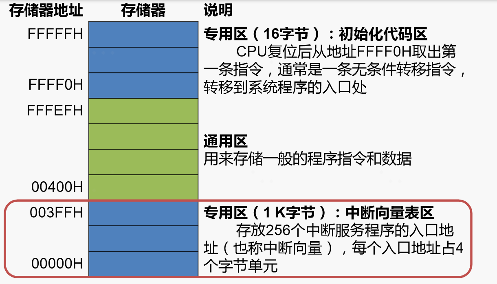
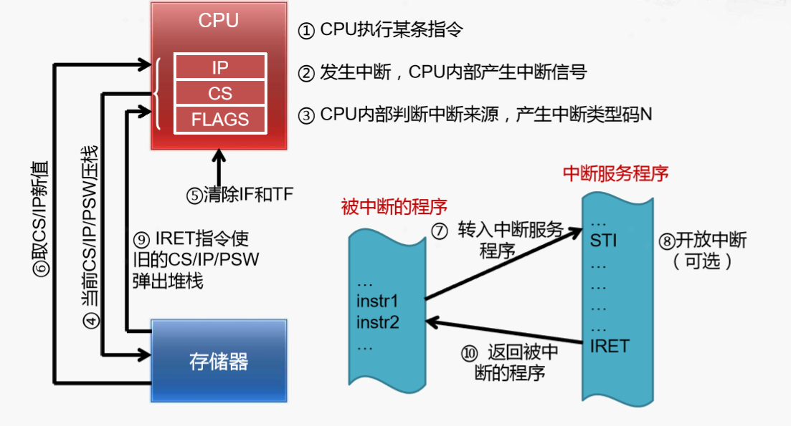
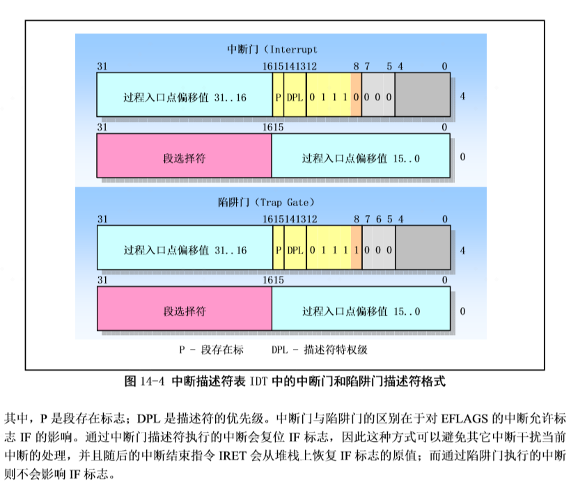
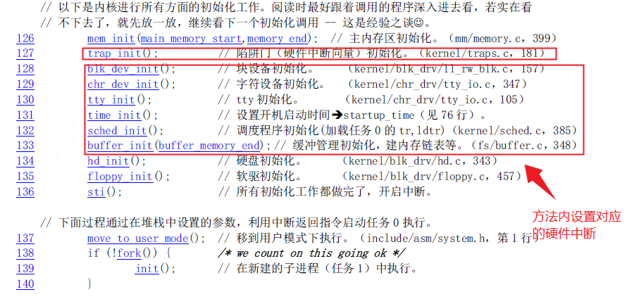
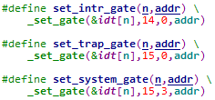
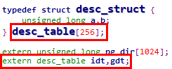

# 中断
## 中断的定义
CPU遇到的“事件”：

> - 在程序运行时，系统外部、内部或现行程序本身出现需 要特殊处理的“事件” 
> - CPU立即强行中止现行程序的运行，改变机器的工作状 态并启动相应的程序来处理这些“事件” 
> - 处理完成后，CPU恢复原来的程序运行

这些“事件”被称为“中断”或“异常”。
## 中断相关的硬件电路
[北京大学——计算机组成与设计——中断](https://www.bilibili.com/video/BV1tp4y197Av?p=46)
## 中断的进步
### Intel  8086（1978年） 

#### 实模式下的存储器地址空间 
> 存储器中保留两个专用区域
> 
>  • 中断向量表区：00000H~003FFH（地址最低的1KB） 
>  
>  • 初始化程序区：FFFF0H~FFFFFH（地址最高的16B）




#### 中断向量（interrupt vector） —— 中断服务程序的入口地址 
> 每个中断类型对应一个中断向量（4字节） 
> 
> ◦ 前两个字节单元存放中断服务程序入口地址的偏移量（IP）， 低字节在前，高字节在后 
> 
> ◦ 后两个字节单元存放中断服务程序入口地址的段基值（CS）， 低字节在前，高字节在后


#### 中断向量和中断服务程序


#### 8086的中断向量表
> 由`BIOS`初始化放置到`0x00000`的位置。


### 保护模式(IA-32)的中断操作
> 中断向量表位置不同，每个中断描述符8个字节，256个中断描述符共2K字节，其它操作与实模式类似。


### 内部中断类型说明
[内部中断类型说明（点击查看）](README.assets/805-内部中断分类说明.pdf)

### 软中断 —— 中断线程化
// 未来要做这块功能时，再来写这一部分

## 中断执行

### 处理过程

> 1. 关中断: CPU关闭中断响应，即不再接受其它外部中断请求
> 2. 保存断点 : 将发生中断处的指令地址压入堆栈，以使中断处理完后能正确地返回
> 3. 识别中断源 : CPU识别中断的来源，确定中断类型号，从而找到相应的中断服务程序 的入口地址
> 4. 保护现场 : 将发生中断处的有关寄存器（中断服务程序中要使用的寄存器）以及标 志寄存器的内容压入堆栈
> 5. 执行中断服务程序 : 转到中断服务程序入口开始执行，可在适当时刻重新开放中断，以便允 许响应较高优先级的外部中断
> 6. 恢复现场并返回 : 把“保护现场”时压入堆栈的信息弹回原寄存器，然后执行中断返回指 令，从而返回主程序继续运行

上面步骤中：
**1、2、3 由CPU自己完成，4、5、6由中断服务来完成**
其中**第2步**会自动**将 CS、IP、PSW三个寄存器压栈**，因此在**第4步**保护现场时，**不再需要将CS、IP、PSW进行入栈操作，而需要将其它寄存器进行入栈**，**第6步恢复现场时，也只需要恢复其它寄存器的值，而返回时执行`IRET`指令即可使 旧的CS/IP/PSW 弹出堆栈**。



### 中断描述符
1. 在X86体系结构的保护模式下，通过中断描述符表IDT组织中断描述符

2. 中断描述符描述的是中断处理程序的入口地址及其属性，根据不同类型，中断描述符可以分为中断门和陷阱门，具体格式如下：



3. 在Linux中，将DPL=3的陷阱门称作系统门, 系统门有如下特点：

	① 通过系统门（陷阱门）进入中断处理函数时，EFLAGS寄存器的IF位保持不变，也就是不会进行关中断操作。—— 系统调用一般通过系统门实现。

4. 中断描述符安装在IDT中，他们没有选择子（index + TI + RPL），索引他们的序号（index）就是中断向量

# 系统调用
## 何为系统调用
> 指运行在使用者空间的程序向操作系统内核请求需要更高权限运行的服务。系统调用提供用户程序与操作系统之间的接口。大多数系统交互式操作需求在内核态执行。如设备IO操作或者进程间通信。
## 为什么要有系统调用
用户进程不可避免地需要使用计算机资源(如：内存分配与读写、网卡发送数据、硬盘访问等)，这些资源的使用通常必须满足下面几点：

- 不能被用户程序随意使用，需要进行一些限制。如: 内存访问不允许用户任意读取或写入物理内存。
- 多个应用使用同一资源时，要能够进行合理的资源调度。如：多个进程同时使用网卡进行发送数据。
- 尽量屏蔽底层硬件的复杂度，应用程序程序员 不期望直接与 网卡、内存条等打交道，因为编写这部分代码过于复杂。

基于上面的原因，操作系统不允许用户直接对这些资源来进行操作，而是提供系统调用的方式来让用户通过执行系统调用来对这些资源进行使用。
用户使用系统调用时，仅能传递系统调用需要的必要参数 ，而不能修改系统调用本身的代码。而操作系统在系统调用中，实现了对资源进行**保护与合理调度**，并**屏蔽了底层硬件的复杂度**。
## 系统调用如何实现

系统调用通过中断中的系统门来实现。过程如下：

- 应用程序调用库函数（API）；
- API 将系统调用号存入 EAX，然后通过中断调用(`int 0x80`)使系统进入内核态；
- 内核中的中断处理函数根据系统调用号，调用对应的内核函数（系统调用）；
- 系统调用完成相应功能，将返回值存入 EAX，返回到中断处理函数；
- 中断处理函数返回到 API 中；
- API 将 EAX 返回给应用程序。

### 系统门(中断)如何将cpu从用户态转换为内核态


通过上图，我们可以看出，IDT表项中`系统门`的`DPL`为3，这代表`用户态`可以执行该系统门中断，这个时候只需要将`处理函数段选择符的CPL`设为0,则该中断在执行时，CPU将自动会把此处理函数段选择符赋值给`CS`，从而实现了用户态到内核态的转换。

# 代码实现
## linux 0.11 中`IDT`相关实现
### 启动时`IDT`
在系统刚启动时，CPU为实模式，这个时候IDT的初始化代码在BIOS中，它将IDT表初始化后放在内存 0 地址的位置，其包含磁盘访存等中断，便于操作系统在初始化时调用中断。具体如本文章前面分析的`Intel  8086`中断小节。


### 初始化`IDT`
#### head.s 中初始化idt
```
...
...
call setup_idt

...
...

setup_idt:
    lea ignore_int,%edx
    movl $0x00080000,%eax
    movw %dx,%ax              /* selector = 0x0008 = cs */
    movw $0x8E00,%dx /* interrupt gate：dpl=0, present */

    lea idt,%edi      # 取idt的偏移给edi
    mov $256,%ecx     # 循环256次
rp_sidt:
    movl %eax,(%edi)     # eax -> [edi]
    movl %edx,4(%edi)    # edx -> [edi+4]
    addl $8,%edi         # edi + 8 -> edi
    dec %ecx
    jne rp_sidt
    lidt idt_descr       # 加载IDTR
    ret

...
...

idt_descr:
    .word 256*8-1       # idt contains 256 entries
    .long idt           # IDT 的线性基地址

...
...

idt: 
    .fill 256,8,0       # idt is uninitialized
```
#### main.c 中初始化各个设备及陷阱门初始化


#### trapinit()


#### _set_gate
_set_gate 的定义是：
```
// gate_addr：要设置的中断描述符地址
 
// type：中断描述符类型，中断门或陷阱门
 
// dpl：中断描述符DPL
 
// addr：中断处理程序地址
 
#define _set_gate(gate_addr,type,dpl,addr) \
__asm__ ("movw %%dx,%%ax\n\t" \
 
        "movw %0,%%dx\n\t" \
 
        "movl %%eax,%1\n\t" \
 
        "movl %%edx,%2" \
 
        : \ // 没有输出部分，只有输入部分
 
        : "i" ((short) (0x8000+(dpl<<13)+(type<<8))), \  // %0操作数
 
        "o" (*((char *) (gate_addr))), \                 // %1操作数
 
        "o" (*(4+(char *) (gate_addr))), \               // %2操作数
 
        "d" ((char *) (addr)),     // %3操作数
	
	"a" (0x00080000))          // %4操作数
 
 
 
/*
* 输入部分说明
* 0号操作数：约束条件为"i"，表示立即数；中断描述符高4B中的低2B
* 0x8000[P=1]+(dpl<<13)[门描述符特权级级]+(type<<8)[门描述符类型]
* 1号操作数：约束条件为"o"，表示内存单元
* 要设置的中断描述符地址解引用，存放中断描述符低4B，相当于汇编指令中[gate_addr]
* 2号操作数：约束条件为"o"，表示内存单元
* 要设置的中断描述符地址解引用，存放中断描述符高4B，相当于汇编指令中[gete_addr + 4]
* %3号操作数：约束条件为"d"，表示要求使用寄存器edx
* edx = 中断处理程序地址
* %4号操作数：约束条件为"a"，表示要求使用寄存器eax
* eax = 0x00080000，内核代码段选择子
*/
 
 
 
/*
* 组装与安装过程
* 1. movw %%dx, %%ax
* ax = 中断处理程序地址低16位
* 2. movw %0, %%dx
* dx = [P=1] + [门描述符特权级] + [门描述符类型]
* 3. movl %%eax, %1
* [gate_addr] = 中断描述符低4B，内核代码段选择子 + 中断处理程序地址低16位
* 4. movl %%edx, %2
* [gate_addr + 4] = 中断描述符高4B，中断处理程序地址高16位 + [P=1] + [门描述符特权级] + [门描述符类型]
*/
```

说明1：在Linux 0.11中，通过调用_set_gate宏，构成了3个组装和安装中断描述符的宏，分别如下



① set_intr_gate：安装中断门（门类型0b1110），门描述符特权级为0

② set_trap_gate：安装陷阱门（门类型0b1111），门描述符特权级为0

③ set_system_gate：安装系统门（门类型0b1111），门描述符特权级为3

说明2：_set_gate宏中使用的idt变量就是system模块中定义的中断描述符表IDT

① IDT在汇编代码中的定义（head.s）


_idt就是256个中断描述符存储区域的线性地址

② IDT在C代码中的声明（head.h）

idt是一个数组名，也就是数组的首地址，该数组共有256个元素，每个元素8B，这点和中断描述符表的定义是匹配的。

具体细节请参考《注释》的第 14 章。

## `系统调用`相关实现
### 系统调用初始化
在内核初始化时，主函数（在 `init/main.c` 中，Linux 实验环境下是 `main()`，Windows 下因编译器兼容性问题被换名为 `start()`）调用了 `sched_init()` 初始化函数：
```
void main(void)
{
//    ……
    time_init();
    sched_init();
    buffer_init(buffer_memory_end);
//    ……
}
```
sched_init() 在 kernel/sched.c 中定义为：
```
void sched_init(void)
{
//    ……
    set_system_gate(0x80,&system_call);
}
```
set_system_gate 是个宏，在 include/asm/system.h 中定义为：
```
#define set_system_gate(n,addr) \
    _set_gate(&idt[n],15,3,addr)
```
### 进行系统调用
在通常情况下，调用系统调用和调用一个普通的自定义函数在代码上并没有什么区别，但调用后发生的事情有很大不同。

调用自定义函数是通过 call 指令直接跳转到该函数的地址，继续运行。

而调用系统调用，是调用系统库中为该系统调用编写的一个接口函数，叫 API（Application Programming Interface）。API 并不能完成系统调用的真正功能，它要做的是去调用真正的系统调用，过程是：

- 把系统调用的编号存入 EAX；
- 把函数参数存入其它通用寄存器；
- 触发 0x80 号中断（int 0x80）。
linux-0.11 的 lib 目录下有一些已经实现的 API。Linus 编写它们的原因是在内核加载完毕后，会切换到用户模式下，做一些初始化工作，然后启动 shell。而用户模式下的很多工作需要依赖一些系统调用才能完成，因此在内核中实现了这些系统调用的 API。

>后面的目录如果没有特殊说明，都是指在 /home/shiyanlou/oslab/linux-0.11 中。比如下面的 lib/close.c，是指 /home/shiyanlou/oslab/linux-0.11/lib/close.c。

我们不妨看看 lib/close.c，研究一下 close() 的 API：
```
#define __LIBRARY__
#include <unistd.h>

_syscall1(int, close, int, fd)
```
其中 _syscall1 是一个宏，在 include/unistd.h 中定义。
```
#define _syscall1(type,name,atype,a) \
type name(atype a) \
{ \
long __res; \
__asm__ volatile ("int $0x80" \
    : "=a" (__res) \
    : "0" (__NR_##name),"b" ((long)(a))); \
if (__res >= 0) \
    return (type) __res; \
errno = -__res; \
return -1; \
}
```
将 _syscall1(int,close,int,fd) 进行宏展开，可以得到：
```
int close(int fd)
{
    long __res;
    __asm__ volatile ("int $0x80"
        : "=a" (__res)
        : "0" (__NR_close),"b" ((long)(fd)));
    if (__res >= 0)
        return (int) __res;
    errno = -__res;
    return -1;
}
```
这就是 API 的定义。它先将宏 \__NR_close 存入 EAX，将参数 fd 存入 EBX，然后进行 0x80 中断调用。调用返回后，从 EAX 取出返回值，存入 __res，再通过对 __res 的判断决定传给 API 的调用者什么样的返回值。

其中 \__NR_close 就是系统调用的编号，在 include/unistd.h 中定义：
```
#define __NR_close    6
/*
所以添加系统调用时需要修改include/unistd.h文件，
使其包含__NR_whoami和__NR_iam。
*/
```

```
/*
而在应用程序中，要有：
*/

/* 有它，_syscall1 等才有效。详见unistd.h */
#define __LIBRARY__

/* 有它，编译器才能获知自定义的系统调用的编号 */
#include "unistd.h"

/* iam()在用户空间的接口函数 */
_syscall1(int, iam, const char*, name);

/* whoami()在用户空间的接口函数 */
_syscall2(int, whoami,char*,name,unsigned int,size);
```
在 0.11 环境下编译 C 程序，包含的头文件都在 /usr/include 目录下。

该目录下的 unistd.h 是标准头文件（它和 0.11 源码树中的 unistd.h 并不是同一个文件，虽然内容可能相同），没有 \__NR_whoami 和 \__NR_iam 两个宏，需要手工加上它们，也可以直接从修改过的 0.11 源码树中拷贝新的 unistd.h 过来。
