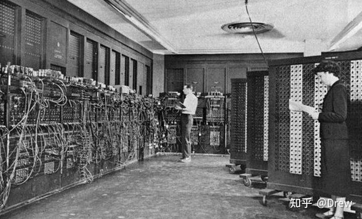
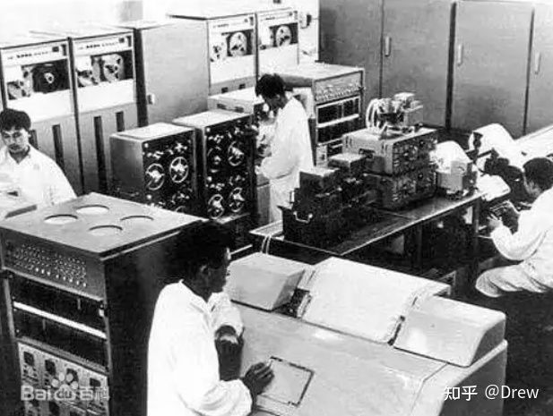
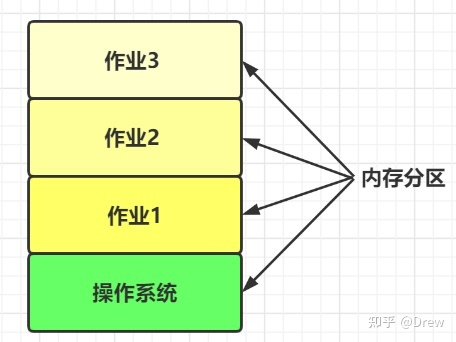
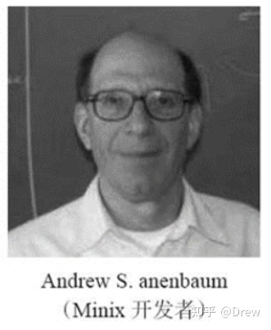
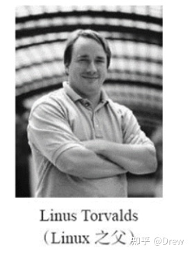

# 操作系统历史
## 1. 什么是操作系统
精简的说的话，操作系统就是一个协调、管理和控制计算机硬件资源和软件资源的控制程序。操作系统所处的位置如下图所示：


操作系统位于计算机硬件与应用软件之间，本质也是一个软件。操作系统由操作系统的内核（运行于内核态，管理硬件资源）以及系统调用（运行于用户态，为应用程序员写的应用程序提供系统调用接口）两部分组成，所以，单纯的说操作系统是运行于内核态的，是不准确的。

### 1.1 操作系统作用
#### 1.1.1 为应用程序提供如何使用硬件资源的抽象。
隐藏了丑陋的硬件调用接口，为应用程序员提供调用硬件资源的更好，更简单，更清晰的模型（系统调用接口）。应用程序员有了这些接口后，就不用再考虑操作硬件的细节，专心开发自己的应用程序即可。


##### 举例：
操作系统提供了文件这个抽象概念，对文件的操作就是对磁盘的操作，有了文件我们无需再去考虑关于磁盘的读写控制。

##### 注意：
> 
> 操作系统提供给应用程序的该抽象是简单，清晰，优雅的。为何要提供该抽象呢？
> 
> 硬件厂商需要为操作系统提供自己硬件的驱动程序（设备驱动，这也是为何我们要使用声卡，就必须安装声卡驱动），厂商为了节省成本或者兼容旧的硬件，它们的驱动程序是复杂且丑陋的。
> 
> 操作系统就是为了隐藏这些丑陋的信息，从而为用户提供更好的接口，这样用户使用的shell，Gnome，KDE看到的是不同的界面，但其实都使用了同一套由linux系统提供的抽象接口


#### 1.1.2 管理硬件资源
现代的操作系统运行同时运行多道程序，操作系统的任务是在相互竞争的程序之间有序地控制对处理器、存储器以及其他I/O接口设备的分配。

##### 举例：
同一台计算机上同时运行三个程序，它们三个想在同一时刻在同一台计算机上输出结果，那么开始的几行可能是程序1的输出，接着几行是程序2的输出，然后又是程序3的输出，最终将是一团糟（程序之间是一种互相竞争资源的过程）

操作系统将打印机的结果送到磁盘的缓冲区，在一个程序完全结束后，才将暂存在磁盘上的文件送到打印机输出，同时其他的程序可以继续产生更多的输出结果（这些程序的输出没有真正的送到打印机），这样，操作系统就将由竞争产生的无序变得有序化。

## 2. 为什么要有操作系统
现代的计算机系统主要是由一个或者多个处理器，主存，硬盘，键盘，鼠标，显示器，打印机，网络接口及其他输入输出设备组成。可以看出来现代计算机系统是一个复杂的系统。因此：

- 如果每位应用程序员都必须掌握该系统所有的细节，那就不可能再编写代码了（严重影响了程序员的开发效率：全部掌握这些细节可能需要一万年....）

- 管理这些部件并加以优化使用，是一件极富挑战性的工作，于是，计算安装了一层软件（系统软件），称为操作系统。它的任务就是为用户程序提供一个更好、更简单、更清晰的计算机模型，并管理刚才提到的所有设备。

##### 总结
程序员无法把所有的硬件操作细节都了解到，管理这些硬件并且加以优化使用是非常繁琐的工作，这个繁琐的工作就是操作系统来干的，有了他，程序员就从这些繁琐的工作中解脱了出来，只需要考虑自己的应用软件的编写就可以了，应用软件直接使用操作系统提供的功能来间接使用硬件。

## 3. 当前操作系统源码
当前，操作系统是一个大型、复杂、长寿的软件：
- 大型：linux或windows的源代码有五百万行数量级。按照每页50行共1000行的书来算，五百万行要有100卷，要用一整个书架子来摆置，这还仅仅是内核部分。

- 长寿：操作系统很难编写，如此大的代码量，一旦完成，操作系统所有者便不会轻易扔掉，再写一个。而是在原有的基础上进行改进。（基本上可以把windows95/98/Me看出一个操作系统，而windows NT/2000/XP/Vista则是两位一个操作系统，对于用户来说它们十分相似。还有UNIX以及它的变体和克隆版本也演化了多年，如System V版，Solaris以及FreeBSD等都是Unix的原始版，不过尽管linux非常依照UNIX模式而仿制，并且与UNIX高度兼容，但是linux具有全新的代码基础）

## 4. 洪荒时代操作系统的发展历程
### 4.1 第一代计算机（真空管和穿孔卡片）—— 1940~1955

#### 4.1.1 产生背景：

第一代之前人类是想用机械取代人力，第一代计算机的产生是计算机由机械时代进入电子时代的标志，从Babbage失败之后一直到第二次世界大战，数字计算机的建造几乎没有什么进展，第二次世界大战刺激了有关计算机研究的爆炸性进展。

lowa州立大学的john Atanasoff教授和他的学生Clifford Berry建造了据认为是第一台可工作的数字计算机。该机器使用300个真空管。大约在同时：
- Konrad Zuse在柏林用继电器构建了Z3计算机
- 英格兰布莱切利园的一个小组在1944年构建了Colossus
- Howard Aiken在哈佛大学建造了Mark 1
- 宾夕法尼亚大学的William Mauchley和他的学生J.Presper Eckert建造了ENIAC。

这些机器有的是二进制的，有的使用真空管，有的是可编程的，但都非常原始，设置需要花费数秒钟时间才能完成最简单的运算。

在这个时期，同一个小组里的工程师们，设计、建造、编程、操作及维护同一台机器，所有的程序设计是用纯粹的机器语言编写的，甚至更糟糕，需要通过成千上万根电缆接到插件板上连成电路来控制机器的基本功能。没有程序设计语言（汇编也没有），操作系统则是从来都没听说过。使用机器的过程更加原始，详见下‘工作过程’。

#### 4.1.2 特点：
没有操作系统的概念
所有的程序设计都是直接操控硬件

#### 4.1.3 工作过程：
程序员在墙上的机时表预约一段时间，然后程序员拿着他的插件版到机房里，将自己的插件板接到计算机里，这几个小时内他独享整个计算机资源，后面的一批人都得等着(两万多个真空管经常会有被烧坏的情况出现)。

后来出现了穿孔卡片，可以将程序写在卡片上，然后读入机而不用插件板
#### 4.1.4 优点
首代计算机诞生，可以代替人类做很多复杂的计算工作。
#### 4.1.5 缺点：

浪费计算机资源，一个时间段内只有一个人用。

注意：同一时刻只有一个程序在内存中，被cpu调用执行，如果有10个程序的执行，那么它们就是串行的。

### 4.2 第二代计算机（晶体管和批处理系统）—— 1955~1965

#### 4.2.1 产生背景
由于当时的计算机非常昂贵，很自然的人们要想办法减少机时的浪费。通常采用的方法就是批处理系统。
#### 4.2.2 特点：
- 设计人员、生产人员、操作人员、程序人员和维护人员直接有了明确的分工，计算机被锁在专用空调房间中，由专业操作人员运行，这便是‘大型机’。
- 有了操作系统的概念
- 有了程序设计语言：FORTRAN语言或汇编语言，写到纸上，然后穿孔打成卡片，再讲卡片盒带到输入室，交给操作员，然后喝着咖啡等待输出接口
#### 4.2.3 工作过程

#### 4.2.4 第二代如何解决第一代的问题/缺点：
1. 把一堆人的输入攒成一大波输入，
2. 然后顺序计算（这是有问题的，但是第二代计算也没有解决）
3. 把一堆人的输出攒成一大波输出
#### 4.2.4 优点
- 批处理，节省了机时

#### 4.2.5 缺点：
1. 整个流程需要人参与控制，将磁带搬来搬去（中间俩小人）
2. 计算的过程仍然是顺序计算 -> 串行
3. 程序员原来独享一段时间的计算机，现在必须被统一规划到一批作业中，等待结果和重新调试的过程都需要等同批次的其他程序都运作完才可以（这极大的影响了程序的开发效率，无法及时调试程序）

### 4.3 第三代计算机（集成电路芯片和多道程序设计）—— 1965~1975
#### 4.3.1 产生背景：

20世纪60年代初期，大多数计算机厂商都有两条完全不兼容的生产线。

一条是面向字的：大型的科学计算机，如IBM 7094，主要用于科学计算和工程计算

另外一条是面向字符的：商用计算机，如IBM 1401，主要用于银行和保险公司从事磁带归档和打印服务

开发和维护完全不同的产品是昂贵的，同时不同的用户对计算机的用途不同。

IBM公司试图通过引入system/360系列来同时满足科学计算和商业计算，360系列低档机与1401相当，高档机比7094功能强很多，不同的性能卖不同的价格

360是第一个采用了（小规模）芯片（集成电路）的主流机型，与采用晶体管的第二代计算机相比，性价比有了很大的提高。这些计算机的后代仍在大型的计算机中心里使用，此乃现在服务器的前身，这些服务器每秒处理不小于千次的请求。
#### 4.3.2 如何解决第二代计算机的问题
##### 4.3.2.1 问题1：第二代计算机中，整个流程需要人参与控制，将磁带搬来搬去（中间俩小人）
卡片被拿到机房后能够很快的将作业从卡片读入磁盘，于是任何时刻当一个作业结束时，操作系统就能将一个作业从磁带读出，装进空出来的内存区域运行。

同时的外部设备联机操作：SPOOLING，该技术同时用于输出。当采用了这种技术后，就不在需要IBM1401机了，也不必将磁带搬来搬去了（中间俩小人不再需要）
#### 4.3.2.2 问题2：第二代计算机中，计算的过程仍然是顺序计算 -> 串行
第三代计算机的操作系统广泛应用了第二代计算机的操作系统没有的关键技术：**多道技术**。
#####  多道技术
多道技术中的多道指的是多个程序，多道技术的实现是为了解决多个程序竞争或者说共享同一个资源（比如cpu）的有序调度问题，解决方式即多路复用，多路复用分为时间上的复用和空间上的复用。
- 空间上的复用：

  
  
  > 将内存分为几部分，每个部分放入一个程序，这样，同一时间内存中就有了多道程序。

- 时间上的复用：
  >当一个程序在等待I/O时，另一个程序可以使用cpu，如果内存中可以同时存放足够多的作业，则cpu的利用率可以接近100%，类似于我们小学数学所学的统筹方法。（操作系统采用了多道技术后，可以控制进程的切换，或者说进程之间去争抢cpu的执行权限。这种切换不仅会在一个进程遇到io时进行，一个进程占用cpu时间过长也会切换，或者说被操作系统夺走cpu的执行权限）

#### 4.3.2.3 问题3：第二代计算机中，程序员原来独享一段时间的计算机，现在必须被统一规划到一批作业中，等待结果和重新调试的过程都需要等同批次的其他程序都运作完才可以（这极大的影响了程序的开发效率，无法及时调试程序）
分时操作系统(多个联机终端+多道技术)用来解决这个问题.

> 举例：20个客户端同时加载到内存，有17在思考，3个在运行，cpu就采用多道的方式处理内存中的这3个程序，由于客户提交的一般都是简短的指令而且很少有耗时长的，索引计算机能够为许多用户提供快速的交互式服务，所有的用户都以为自己独享了计算机资源。

#### 4.3.3 分时操作系统的发展
分时操作系统中最大的难点便是空间上的复用：


空间上的复用最大的问题是：程序之间的内存必须分割，**这种分割需要在硬件层面实现，由操作系统控制**。

如果内存彼此不分割，则一个程序可以访问另外一个程序的内存，会导致下面两个问题：

- 首先丧失的是安全性，比如你的qq程序可以访问操作系统的内存，这意味着你的qq可以拿到操作系统的所有权限。

- 其次丧失的是稳定性，某个程序崩溃时有可能把别的程序的内存也给回收了，比方说把操作系统的内存给回收了，则操作系统崩溃。

**因此第三代计算机广泛采用了必须的保护硬件（程序之间的内存彼此隔离）之后，分时系统才开始流行**。当第三代计算机诞生之后，下面的操作系统开始一个接着一个诞生出来：

- **CTTS**：麻省理工（MIT）在一台改装过的7094机上开发成功的，CTTS兼容分时系统。

- **MULTICS**，贝尔实验室和通用电气在CTTS成功研制后决定开发能够同时支持上百终端的MULTICS（其设计者着眼于建造满足波士顿地区所有用户计算需求的一台机器），很明显真是要上天啊，最后摔死了。

- **UNIX**：后来一位参加过MULTICS研制的贝尔实验室计算机科学家Ken Thompson开发了一个简易的，单用户版本的MULTICS，这就是后来的UNIX系统。

- **POSIX(是标准，不是操作系统)**： 基于UNIX衍生了很多其他的Unix版本，为了使程序能在任何版本的unix上运行，IEEE提出了一个unix标准，即posix（可移植的操作系统接口Portable Operating System Interface）

- **Minix**：后来，在1987年，出现了一个UNIX的小型克隆，即minix，用于教学使用。

- **Linux**： 芬兰学生Linus Torvalds基于Minix和POSIX标准编写了Linux。

### 4.4 第四代计算机（个人计算机）1980~至今(略)

## 5. 现代操作系统的发展史之关键人物
### 5.1 B语言与C语言
### 5.1.1 B语言之父：Ken Thompson（肯·汤普森）


1969年前后,Ken Thompson（肯.汤普森）在Dennis Ritchie丹尼斯.里奇（Dennis Ritchie）的支持下设计出来的一种通用的程序设计语言，现在使用者已经很少了。
### 5.1.2 C语言之父：Dennis Ritchie（丹尼斯·里奇）


1969-1973年，Dennis Ritchie（丹尼斯·里奇）在美国电话电报公司（AT&T）的贝尔实验室内开始了C语言的最初研发。根据丹尼斯·里奇说，C 语言最重要的研发时期是在1972年。

C语言之所以命名为C，是因为C语言源自Ken Thompson发明的 B语言，而B语言则源自BCPL语言，所以先B后C嘛哈哈。
### 5.2 Unix系统
Unix之父还是他们哥俩：Ken Thompson（肯.汤普森）与Dennis Ritchie（丹尼斯·里奇）

Unix诞生于1969年，ken Tphmpson（肯.汤普森）最初用汇编语言编写，后来他和Dennis Ritch（丹尼斯·里奇）一起用高级C语言重写。

事实上，C语言的诞生是和UNIX操作系统的开发密不可分的，原先的UNIX操作系统都是用汇编语言写的，1973年UNIX操作系统的核心用C语言改写，从此以后，C语言成为编写操作系统的主要语言。

UNIX 第一次公开露面是 1973 年丹尼斯·里奇和肯·汤普森在操作系统原理（Operating Systems Principles）上发表的一篇论文，然后 AT&T 发布了 UNIX 系统第 5 版，并授权给教育机构使用，之后在 1975 年第一次以 $20.000的价格授权企业使用 UNIX 第 6 版。应用最广泛的是 1980 年发布的 UNIX 第 7 版，任何人都可以购买授权，只是授权条款非常严格

Unix的诞生对整个后续操作系统发展具有深远的影响，Ken Thompson（肯.汤普森）与Dennis Ritchie（丹尼斯·里奇）也因此获得了1983的图灵奖（计算机界的诺贝尔奖）

2011年10月12日（北京时间为10月13日），C语言之父丹尼斯·里奇去世，享年70岁。
### 5.3 Go语言


Go语言是在2007年由三个创始人在业余时间联合开发：Robert Griesemer（罗伯特.格利茨默）、Rob Pike（罗伯.派克）、Ken Thompson（肯.汤普森）

## 6. 现代操作系统发展史
### 6.1 Multics操作系统
MULTICS 其实是"MULTiplexed Information and Computing System"的缩写。

Bell(贝尔实验室), MIT（麻省理工学院人工智能实验室）, GE（General Electric，通用电气）联合建立Multics操作系统。
Multics操作系统是一套多使用者、多任务、多层次。

Multics是完成了，但是Multics 不断完善，和追求高目标，目标不明确了，渐渐的目标迷失，GE退出，后面bell也退出了。
### 6.2 unix的诞生
贝尔实验属于：AT&T

bell 为完成multics招聘了很多优秀的工程师，退出Multics后工程师比较闲了。

ken Tphmpson（肯.汤普森）在multics制作了一款游戏：space Travel（星际旅行）跑在multics。

bell 退出multics之后，ken Tphmpson（肯.汤普森）不能使用multics的运算能力了，要使用得付费。所以决定自己写一个小型系统程序可以跑起自己的游戏。

向公司申请购买PDP-11小型计算机，驳回。

PDP-11属于DEC（数字设备公司），该公司还有VAX（VMS）电脑。

在公司某角落找到PDP-7，老古董，使用汇编语言编码。

老古董好过没有，他在上面写了系统，居然可以跑起他的游戏了。

1969年，他兴奋的向各个同事兜售游戏，几乎所有的同事对于游戏没有兴趣，但是对他的系统很感兴趣，在1970年时，那部PDP-7却只能支持两个使用者，所以当时，Brian Kernighan（布莱恩·克尼汉）就开玩笑地戏称他们的系统其实是："UNiplexed Information and Computing System"（复杂的信息与计算系统），缩写为"UNICS"，后来，大家取其谐音，就称其为"Unix"了，Unix因此得名，所以1970年可称为是Unix元年。

unix系统短小精悍，性能很强大，接口规范，当然功能有限。

以现在的眼光看unix依然强大没有硬伤，可见unix的设计是何等超前和强大的。

unix真正的使用，在1971年，贝尔实验室需要为自己的专利部门提供一个文字处理程序nroff。该程序的运行，需要一个底层系统。nroff在PDP运行的并不好，所以决定自己写一个系统。

ken Tphmpson（肯.汤普森）和他的同事一起承包了这个项目。unix也在这当中得到了发展。

unix刚开始用汇编语言B语言所写，跟计算机PDP7耦合太大。

后来Dennis Ritch（丹尼斯·里奇）用高级C语言重写了，适用范围扩大了。

但是，当时这么做风险很大，语言越高级，消耗的计算机性能越大，而当时的计算机性能很差。
#### 6.2.1 UNIX的问世
1974，双方发表一片论文在《美国计算机通信》，unix第一次公知于众，走出贝尔实验室。引起很大反响。

很多人期望学习和研究unix。

AT&T（美国电话电报公司）当时被美国裁定不能销售除电话电报以外任何商品，不仅不能销售，别人要还需给。ken那是很长一段时间，把unix系统发给别人。

很多人加入的研究，反馈给贝尔实验室，unix发展迅速。

##### unix发行：
- 1978:SCO 包装发行商用版unix   # SCO 现在SCO是世界上首屈一指的业务关键性(Business Critical)服务器系统软件供应商
- 1979 年发行了：System V7（现在公认的第一个完美版本）
- 1980年DARPA（机构）想研究TCP/IP协议。把这个合同给了BSD。TCP/IP协议在unix上诞生了。
- 1980: Microsoft, XENIX包装发行商用版unix
- BSD后面也开始发行了商业版。
- windows 1990年之前一直在Unix上开发的。

- Berkeley(美国加州伯克利学校): Ken 1979年在berkeley上课。
- Bill Joy, BSRG, 1977, BSD(Berkeley System Distribution)发行的unix版本
- 1980年，美国DARPA（Defense Advanced Research Projects Agency）美国国防高级研究计划局 ,准备制定 TCP/IP协议，最终选择了BSD合作，BSD在unix基础上研究的TCP/IP协议，所以这对unix是一个极大的促进。

#### 6.2.2 UNIX的家谱

UNIX的历史开始于1969年ken Thompson，Dennis Ritchie（即著名的K&G，C语言的发明人）与一群人在一部PDP-7上进行的一些工作，后来这个系统变成了UNIX。它主要的几个版本为：
- V1（1971）：第一版的UNIX，以PDP-11/20的汇编语言写成。包括文件系统，fork、roff、ed等软件。
- V4（1973）：以C语言从头写过，这使得UNIX修改容易，可以在几个月内移植到新的硬件平台上。最初C语言是为UNIX设计的，所以C与UNIX间有紧密的关系。
- V6（1975）：第一个在贝尔实验室外（尤其是大学中）广为流传的UNIX版本。这也是UNIX分支的起点与广受欢迎的开始。1.xBSD （PDP-II）就是由这个版本衍生出来的。
- V7（1979）：在许多UNIX玩家的心目中，这是“最后一个真正的UNIX，”这个版本包括一个完整的K&RC编译器，Bourne shell（交换式的命令解释器和命令编程语言）。V7移植到VAX机器后称为32V。

目前开发UNIX（System V）的公司是Unix System Laboratories (USL)。USL本为AT&T（美国电话电报公司）所有，1993年初被Novell（网络系统公司）收购。Novell（网络系统公司）于1993年末将UNIX这个注册商标转让给X/Open（国际联盟组织）。

目前为止，UNIX有两大流派：那就是AT&T（美国电话电报公司）发布的UNIX操作系统System V与美国加州大学伯克利分校发布的UNIX版BSD（Berkeley Software Distribution）。SVR4是两大流派融合后的产物。1991年底，与System V针锋相对的开放软件基金会(Open Software Foundation)推出了OSF/1。
  
现在几种主要的UNIX版本：
- AIX：IBM的UNIX，是根据SVR2（最近已经出到SVR3.2）以及一部分BSD延伸而来，加上各种硬件的支持。具备特有的系统管理（SMIT）。
- 386BSD：Jolitz（比尔·乔利兹）从Net/2 software移植过来的。支持Posix，32位。
- FreeBSD：1.x从386BSD 0.1而来，FreeBSD 2.x版是用4.4BSD lite改写。
- HP-UX（HP）：旧系统是从S III（SVRx）发展面来，现在是由SVR2（4.2BSD）发展而来，目前是10.x版。
- Linux(x86)：遵从POSIX，SYSV及BSD的扩展，这一点从上页表中即可看出。
- OSF/1（DEC）：DEC对OSF/1的移植。
- SCO UNIX（x86）：SVR3.2，目前影响较大的PC UNIX。
- SunOS（680x0，Sparc，i386）：根据4.3BSD，包含许多来自System V的东西。Sun的主要成果在于：NFS，OpenLook GUI标准，现演变为Solaris 。
- Ultrix(DEC)：根据4.2BSD再加上许多4.3BSD的东西。
- Xenix(x86)：Intel硬件平台上的UNIX，以SVR2为基础，由微软推出。在中国使用较广泛。

### 6.3 其他操作系统的发展：windows-图形操作系统的时代
1981年，那时候个人计算机已经出现，但是没有系统，unix不屑于个人计算机的低性能。一个教授写了一个个人计算机系统CPM卖3W美元。

SCP（西雅图计算机产品公司）：一个员工写了一个QDOS（Quick and Dirty Operating System）系统。

Bill Gates比尔盖茨，他的母亲在IBM公司上班。通过他的母亲知道IBM准备大批售卖个人计算机，花5W买断了该系统QDOS版权，然后和IBM的PC机一起售卖一台20几美元，赚了几千万。


在1990之前，window的开发也一直是在unix上的。

SUN公司的Bill joy（比尔·乔伊），发行了workstation系统（工作站鉴于服务器和个人计算机之间）

##### windows和apple爱恨情仇

intel ：当时主要生产内存，cpu比较低级，但是日本也开始生产更好的内存，intel转型专注生产cpu。

cpu的高速发展，导致个人计算机快速的普及。

XEROX: PARK实验室。鼠标和以太网就是park开发出来的。star 图形界面操作系统也被他们开发出来了。

乔布斯在park实验室看到了受到冷遇的图形界面操作系统，立即被apple购入。

比尔盖茨听说过之后，和乔布斯说向你学习学习。参考过后，觉得这绝对是一个影响世人的使用，立即和乔布斯商量，说我研究之后给你共享成果，年轻的乔布斯居然相信了。然后比尔盖茨在DOS上拼凑了一个图形界面系统，抢在乔布斯之前发布了图形界面系统，抢了乔布斯的客户。乔布斯大为恼火，去找比尔盖茨理论，然后终究不是老辣的比尔盖茨的对手，最后被比尔盖茨各种手段逼退了。

DOS是个非常实用的[操作系统]，因此，它深深受到国内外人们的普遍喜爱，一直拥有数以亿计的用户。但是，自从1995年以来，Microsoft公司出于商业利益等方面的原因，决定抛弃手中的MS-DOS。当时，DOS已有许多种，除MS-DOS以外，还有PC-DOS，DR-DOS，FreeDOS等，但是由于受到Microsoft公司的挤压，故使用的人数不多，而大多数用户都在使用MS-DOS。由于Microsoft彻底放弃了MS-DOS，而转以开发Windows，引起了广大DOS使用者和爱好者的不满，而且，大家通常所使用的Windows 9x也只是DOS下的一个大型程序罢了，如果没有DOS的支持，它根本无法运行。但也由此可见[DOS]的功能其实是非常强大的，以及DOS软件拥有巨大的[开发潜能]，因为像Windows那样强大的DOS增强程序都可以编出来，即windows的底层就是基于DOS开发而来的。

VMS被linux抢了饭碗，遇冷。比尔盖茨又拉入了VMS的研究人员。重新开发windows。开发了windows nt(new technology)

apple，乔布斯因内部斗争被赶出了apple，然后成了一个皮克斯动画公司，随后两三年成了好莱坞最著名的动画公司之一，后来又被apple召回委以重任CEO。

### 6.4 unix商业化
AT&T（美国电话电报公司） 被裁定违反了反垄断法，被分拆了，贝尔实验室独立出来了。

贝尔实验室不在受限于只能卖电话电报，那么unix是可以卖的了。那么当年那些受益于unix的，被他看成了肥肉了，是时候索取回报了，直接把BSD告上了法庭。

旷日持久的官司，让他们停步不前，而其他公司迅速发展。也最终导致了Unix这个昔日的巨人的没落。

unix商业化之后，一份unix4W美元。

Unix商业版本：
- SUN：Solaris
- IBM: AIX
- HP:HP-UX
### 6.5 GNU
1985年，Richard Stallman（理查德·马修·斯托曼） 愤怒的认为unix大家都有过添砖加瓦的建设，应该共享。随即，发起GNU(GNU is not unix)自由操作系统，软件共享运动。

- GPL：章程协议，英文全称（general Public License）
- FSF：英文全称（Free Software Foundation）自由软件基金会
- free: freedom。（自由）
- X-window：加入GPL（分散式系统）

```
** GNU软件包列表 **
gcc : gnx c complier
vi: visual interface
…
free: freedom
```
GNU is not unix，但是所有软件建立在unix之上。迫切的希望拥有自己的操作系统。

大学教授Andrew，中文名:谭宁邦 : Minix, 4000行代码，但是不准别人加入代码（洁癖？），所以没能加入进来。

### 6.6. Linux的发展之路
#### 6.6.1.Unix操作系统的诞生

1969年Ken Thompson（肯.汤普森）利用组译语言编写Unix操作系统

1971~1973年Dennis Ritchie（丹尼斯·里奇）以C语言改写Unix

1977年Bill Joy（比尔·乔伊）释放出BSD（Berkeley Software Distribution）的Unix-Like操作系统
#### 6.6.2.X86架构的Minix诞生


1984谭宁邦教授的Minix教学操作系统，提供原始码以及软件


#### 6.6.3.各种免费软件团队的产生


1984 Richard Stallman GNU（GNU's not unix）计划：

Emacs编辑器+GNU C（GCC）+GNU C Library （glibc）+Bash Shell

FSF（free software foundation）自由软件基金会

GPL（General Public License）通用公共许可证

1988年 XFree86计划：X Window System+Free+X86

其他的开源团队： sendmail团队 wu-ftp团队 apache团队

```
#　GNU的GPL解释

　　　　1>任何个人或公司可释放出自由软件(free software)

　　　　2>任何释放出自由软件的个人或公司，均可由自己的服务来收取适当的费用

　　　　3>该软件的原始码(source code)需要随软件附上，并且是可公开发表的

　　　　4>任何人可透过任何正常渠道取得此自由软件，且均可取得此授权模式
```
#### 6.6.4.Linux操作系统的产生


1991年芬兰人开发出Linux（以Minix、GNU、Internet、POSIX标准、虚拟团队）

它是一个基于POSIX 的多用户、多任务并且支持多线程和多CPU的操作系统。

POSIX全称为Portable Operating System Interface，中文翻译为可移植操作系统接口，POSIX标准定义了操作系统应该为应用程序提供的接口


1994年linux 2.0 Linux Distribution(安装套件):Kernel+Free Softwares()+Application Tools

##### 众多的distribution（安装套件）有何异同：

- 相同点：利用同样的Linux Kernel，几乎相同的自由软件套件 (如GNU里面的gcc/glibc/vi/apache/sendmail/bind),几乎相同的操作系统接口 (bash/KDE/GNOME等等)
- 不同点：使用的kernel与各软件的版本可能会不同；各开发商加入的应用工具不同 ，使用的套件管理方式不同(debian与RPM)

##### Linux的发展历程简介 
- 1984年，Andrew S.Tanenbaum开发了用于教学的UNIX系统，命名为Minix。
- 1989年，Andrew S.Tanenbaum将Minix系统运行于x86的PC平台。
- 1990年，芬兰赫尔辛基大学学生Linus Torvalds首次接触Minix系统。
- 1991年，Linus Torvalds开始在Minix上编写各种驱动程序等操作系统内核组件。
- 1991年年底，Linus Torvalds公开了Linux内核源码0.02版（http://www.kernel.org ），注意，这里公开的Linux内核源码并不是我们现在使用的Linux系统的全部，而仅仅是Linux内核（kernel）部分的代码。
- 1993年，Linux 1.0版发行，Linux转向GPL版权协议。
- 1994年，Linux的第一个商业发行版Slackware问世。
- 1996年，美国国家标准技术局的计算机系统实验室确认Linux版本1.2.13（由Open Linux公司打包）符合POSIX标准。
- 1999年，Linux的简体中文发行版问世。
- 2000年后，Linux系统日趋成熟，涌现大量基于Linux服务器平台的应用，并广泛应用于基于ARM技术的嵌入式系统中。
- 2003年4月，Rad Hat Linux 9.0发布。重点放在改善桌面应用方面，包括改进安装过程、更好的字体浏览、更好的打印服务等。2003年，Rad Hat的Linux市场份额超过80%。
- 2004年4月，Red hat公司正式停止对Red Hat 9.0版本的支持，标志着Red Hat Linux的正式完结。原本的桌面版Red Hat Linux发行包则与来自民间的Fedora计划合并，称为Fedora Core发行版本。Red Hat公司不再开发桌面版的Linux发行包，而将全部力量集中在服务器版的开发上，也就是Red Hat Enterprise Linux版。
- 2005年10月RHEL4（Red Hat Enterprise Linux4）发布。
- 2007年3月，主流版本RHEL5（Red Hat Enterprise Linux 5）发布，CentOS系统开始在中国互联网公司流行。
- 2010年4月，RHEL6（Red Hat Enterprise Linux 6.0）BETA测试版发布。
- 2014年6月，RHEL7（Red Hat Enterprise Linux 7.0）发布，RHEL7.0版本和RHEL6.0以前的版本有了较大的变化，例如：内核版本升级到3.10以上，系统启动和基本管理变化较大，文件系统也有传统的ext改为xfs，同时在大数据、云计算、Docker方面做了很大优化。

Linux的发行商包括Slackware、Red Hat、Debian、Fedora、TurboLinux、Mandrake、SUSE、CentOS、Ubuntu、红旗、麒麟……
#### 6.6.5 Linux 内核版本及源码

https://elixir.bootlin.com/

## 7. 总结
### 7.1 操作系统发展简史

批处理系统-》分时操作系统-》multics-》unix-》linux-》各种linux发行版

##### 美国的贝尔实验室诞生了unix，unix系统的优秀特性如下：
1. 技术可靠、稳定性高
2. 极强的可伸缩性、可适用于各种x86架构
3. 强大的网络功能，tcp、ip支持良好
4. 强大的数据库支持能力
5. 强大的开发能力，比如c语言
### 7.2 Linux介绍
linux完全兼容unix的特特性，为何现在linux会如此受欢迎呢？

1. 开源、不收费的操作系统，可自由传播(windows 操作系统收费，不开源)
2. 没有任何的商业化版权制约(也会有商业发行版，但我们都不用)
3. linux支持多用户多任务多线程多cpu，主要用于企业环境


##### linux主要用于：
1. 服务器
2. 嵌入式开发
3. 个人pc桌面
### 7.3 Linux 历史

- 1969年 在美国的贝尔实验室诞生了unix

- 1985年 斯托曼 发起自由软件运动 自由之父 FSF 自由软件基金会

         成立了一个项目 GNU （GNU is not unix）

         成立一个协议 GPL 通用公共许可协议

- 1987年 谭宁邦 大学教授，minix 微内核 主要 用于教学

- 1991年 托瓦兹 大学学生，研究内核 ，发布了0.02版本的Linux，Linux之父

- 1994年 发布了Linux1.0版本 并加入了GPL  -〉  GNU Linux操作系统


##### Linux操作系统的组成：

Linux内核 + GNU的项目 + 成千上万的程序员研发的程序软件
### 7.4 Linux的核心概念

FSF：自由软件基金会的缩写，提供技术上的研发

GNU：是FSF下面的一个项目 GNU is not unix

    优秀的软件：

    Emacs  编辑器 ； gcc 编译软件 ； bash 命令解释器 ；gawk 编程语言； 

    hurd内核（研发中）

GPL：通用公共许可协议

    a，开放源代码，可自由传播

    b，任何人都可以修改，必须把修改之后的源代码发布出来
### 7.5 Linux的发行版本

- redhat 红帽，收费

- Centos 红帽公司收购，去除了redhat的收费及logo部分编译而成的，开源

- Fedora 红帽公司收购，redhat的预发布版，测试版

- Ubuntu 乌班图，桌面版操作系统

- Debian  对安全性要求比较高 FreeBSD差不多

- SUSE  对数据库和电子邮件服务 ，收费的德国用的多；openSUSE免费

## 文章来源
> 该文章转载自：[操作系统的发展历史](https://zhuanlan.zhihu.com/p/367996835)，并对原文章部分结构和表达进行了调整。
> 
> 作者：       [Drew](https://www.zhihu.com/people/drew-62-16)
>
> 转载请注明出处！
## 其他相关历史
- [模拟电路历史](https://www.bilibili.com/video/BV1774114798/?spm_id_from=333.788.recommend_more_video.3&vd_source=afbe39567defad401c79f6fbb57691cf)
- [数字电路历史](https://www.bilibili.com/video/BV1Hi4y1t7zY/?spm_id_from=333.788.recommend_more_video.0&vd_source=afbe39567defad401c79f6fbb57691cf)
- [近代计算机的文艺复兴-冯诺依曼之外](https://www.bilibili.com/video/BV1Uf4y1o7aj?spm_id_from=333.999.0.0&vd_source=afbe39567defad401c79f6fbb57691cf)
