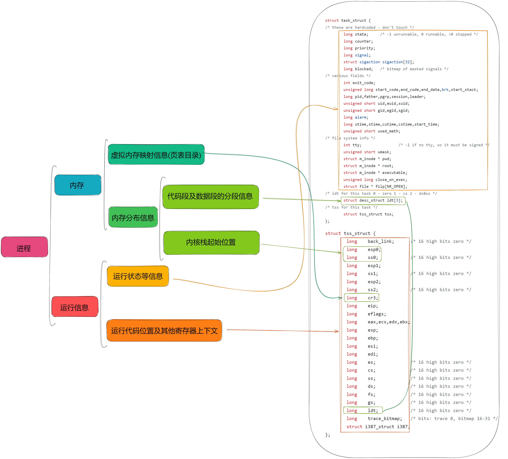

# 进程结构
## Linux进程地址空间与进程内存布局详解
[Linux进程地址空间与进程内存布局详解](https://zhuanlan.zhihu.com/p/348171413?utm_id=0)
## 进程结构

### 进程结构图解

通过上图我们发现，一个进程主要分为下面几块：

- `PCB(task_struct)`：对应 `task_struct` 本身

- 页表目录(虚拟内存的映射表)：对应了 `task_struct -> tss -> cr3`

- `LDT`(代码段、数据段的段描述符)： 对应了`task_struct -> ldt[3]`，其位置对应了 `task_struct -> tss -> ldt` 

- 内核栈的起始位置：对应了 `task_struct -> tss -> esp0`  

- cs、ss、es...等寄存器的值：对应了`task_struct -> tss`中的各个项

**而要让将其和硬件保护模式寻址联合起来时，需要将`LDT`与`TSS`放入`GDT`中**。

要让CPU执行其时，需要：

- 将`TSS`的起始地址通过`ltr`指令放到`TR`寄存器中去(用于索引内核栈起始位置)

- 将`TSS`的各个值覆盖到相应的寄存器上去(比较核心的是`cs eip cr3 ldtr`，例外：0号进程首次初始化及运行时不需要，因为cs,eip等寄存器已经是其当前的代码位置,且`CR3`以在`setup`开启分页模式时已经指定)**。

- 将`LDT`的起始地址通过`lldt`指令放到`LDTR`寄存器中去(用于硬件保护模式寻址)
## 对比通过TSS切换线程与内核栈切换的代码的异同
通过对比通过TSS切换线程与内核栈切换的代码的异同，来加深对于进程结构的理解：
[点击跳转：对比通过TSS切换线程与内核栈切换的代码的异同](https://github.com/lcdzhao/operating_system/blob/master/linux-0.1.1-labs/labs/lab_4_switch_of_process/README.md#%E5%AF%B9%E6%AF%94%E9%80%9A%E8%BF%87tss%E5%88%87%E6%8D%A2%E7%BA%BF%E7%A8%8B%E4%B8%8E%E5%86%85%E6%A0%B8%E6%A0%88%E5%88%87%E6%8D%A2%E7%9A%84%E4%BB%A3%E7%A0%81%E7%9A%84%E5%BC%82%E5%90%8C)

## 关于进程结构的一些问题
- **为什么要将内核空间投射到用户虚拟地址**？

  因为 32 位操作系统总共就只有4个G内存，如果不将内核空间投射到用户虚拟地址空间的话，用户进程（从概念上也会误导程序员）会误以为自己拥有4GB空间可以占用。于是将4GB空间全部占用，而这4GB空间又会映射到真实的物理地址空间。而真实的物理地址空间最大也只有4GB，而且一部分已经用于存放内核代码及数据。因此不能够让用户占满4GB。最优雅的解决方案便是：将内核空间直接映射到虚拟内存中去，用户进程访问时直接报错。这样直观上就能让操作系统用户既能感受到 完整的虚拟内存 的大小，又不会去试图占满整个内存空间。

- **为啥内核空间要映射到最高的一部分内存**？

  便于用户使用，从0去使用地址肯定会让用户更加舒服，也符合用户使用内存地址的直觉。

- **Linux 0.11 有没有这样去将内核空间映射到用户虚拟地址空间中去**？

  没有，因为Linux 0.11的策略是将 4GB 空间划分为很多个64MB的空间(这种划分方式是典型的第三代计算机刚出现时操作系统普遍的一种划分方式，详见[第三台计算机——多道技术](https://github.com/lcdzhao/operating_system/tree/master/theory/%E6%93%8D%E4%BD%9C%E7%B3%BB%E7%BB%9F/0.%20%E6%93%8D%E4%BD%9C%E7%B3%BB%E7%BB%9F%E5%8E%86%E5%8F%B2#%E5%A4%9A%E9%81%93%E6%8A%80%E6%9C%AF))。 每个进程最多占用64MB空间。故不存在有进程占满物理地址空间的情况。所以也就没有必要让用户意识到内核内核空间的存在。所以Linux 0.11 的每个进程多多64MB的虚拟地址空间均为用户空间。
