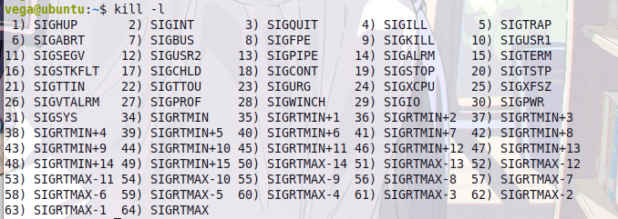
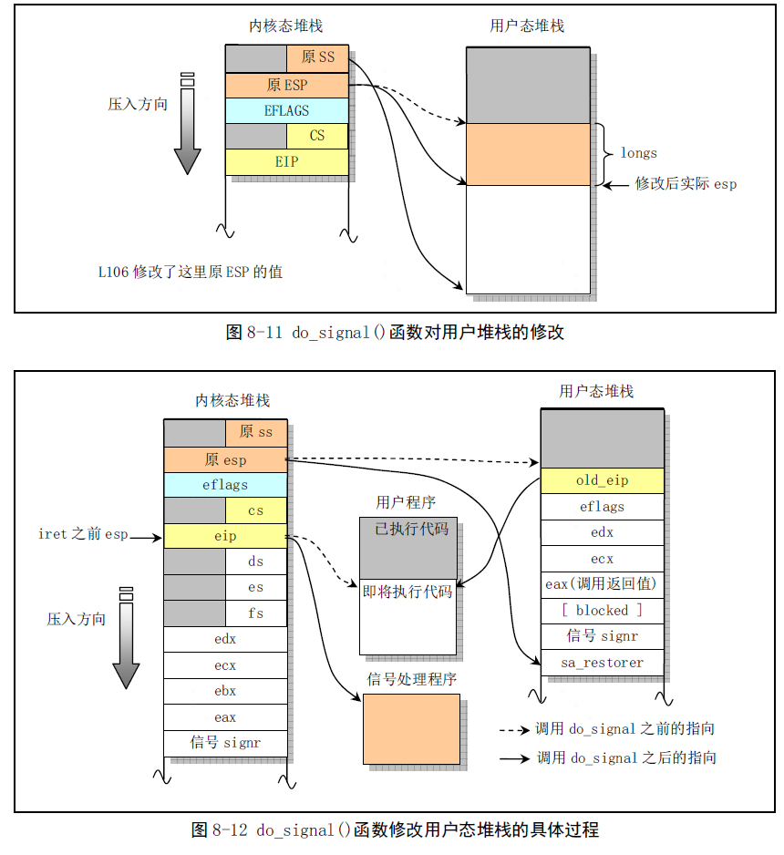

# 进程信号处理
> - 本章节描述了信号处理的核心步骤，更加的解释见: [Linux 内核完全注释](https://github.com/lcdzhao/operating_system/tree/master/linux-0.1.1-labs/linux_0.1.1_%E6%B3%A8%E9%87%8A) 的第 8.8 章节(signal.c)
> - 该视频简单地说明了进程的信号处理，可以作为导读：[【CSAPP-深入理解计算机系统】8-6. 信号](https://www.bilibili.com/video/BV1Xr4y1t7Jt/?spm_id_from=pageDriver&vd_source=afbe39567defad401c79f6fbb57691cf)

进程信号处理分为三个步骤： 
- STEP 1：注册信号处理函数：应用程序通过`signal`或者`sigaction`这两个系统调用注册自己的信号处理函数，如果应用程序自身没注册则使用默认的处理函数。
- STEP 2：发送信号：如`kill`等，发送信号是通过修改进程的`task_struct.singal`来进行信号传递。
- STEP 3：处理信号：操作系统内核通过`do_signal`来处理进程信号。
- STEP 4：从信号处理中恢复：通过`sa_restorer`来恢复用户寄存器值，以及去除当前信号的blocked位等。`sa_restorer`有编译器在链接阶段加入。具体见本章节最后一小节的说明。
## 信号有哪些
### 类型
Linux系统共定义了 64 种信号，分为两大类：`可靠信号`与`不可靠信号`，前32种信号为`不可靠信号`，后32种为`可靠信号`。
> - `不可靠信号`： 也称为非实时信号，不支持排队，信号可能会丢失, 比如发送多次相同的信号, 进程只能收到一次. 信号值取值区间为1~31；
> - `可靠信号`： 也称为实时信号，支持排队, 信号不会丢失, 发多少次, 就可以收到多少次. 信号值取值区间为32~64
### 信号表
在终端，可通过`kill -l`查看所有的signal信号：



取值	名称	解释	默认动作
1	SIGHUP	挂起	 
2	SIGINT	中断	 
3	SIGQUIT	退出	 
4	SIGILL	非法指令	 
5	SIGTRAP	断点或陷阱指令	 
6	SIGABRT	abort发出的信号	 
7	SIGBUS	非法内存访问	 
8	SIGFPE	浮点异常	 
9	SIGKILL	kill信号	不能被忽略、处理和阻塞
10	SIGUSR1	用户信号1	 
11	SIGSEGV	无效内存访问	 
12	SIGUSR2	用户信号2	 
13	SIGPIPE	管道破损，没有读端的管道写数据	 
14	SIGALRM	alarm发出的信号	 
15	SIGTERM	终止信号	 
16	SIGSTKFLT	栈溢出	 
17	SIGCHLD	子进程退出	默认忽略
18	SIGCONT	进程继续	 
19	SIGSTOP	进程停止	不能被忽略、处理和阻塞
20	SIGTSTP	进程停止	 
21	SIGTTIN	进程停止，后台进程从终端读数据时	 
22	SIGTTOU	进程停止，后台进程想终端写数据时	 
23	SIGURG	I/O有紧急数据到达当前进程	默认忽略
24	SIGXCPU	进程的CPU时间片到期	 
25	SIGXFSZ	文件大小的超出上限	 
26	SIGVTALRM	虚拟时钟超时	 
27	SIGPROF	profile时钟超时	 
28	SIGWINCH	窗口大小改变	默认忽略
29	SIGIO	I/O相关	 
30	SIGPWR	关机	默认忽略
31	SIGSYS	系统调用异常	 

对于signal信号，绝大部分的默认处理都是终止进程或停止进程，或dump内核映像转储。 上述的31的信号为非实时信号，其他的信号32-64 都是实时信号。

## 注册信号处理函数
用户可以通过`signal`或者`sigaction`这两个系统调用来注册信号处理函数(具体区别见[Linux内核完全注释](https://github.com/lcdzhao/operating_system/tree/master/linux-0.1.1-labs/linux_0.1.1_%E6%B3%A8%E9%87%8A)第 8.8 章节(signal.c))。
```C
int sys_signal(int signum, long handler, long restorer)
{
	struct sigaction tmp;

	if (signum<1 || signum>32 || signum==SIGKILL)
		return -1;
	tmp.sa_handler = (void (*)(int)) handler;
	tmp.sa_mask = 0;
	tmp.sa_flags = SA_ONESHOT | SA_NOMASK;   //flags这种都是使用一个bit位来表示一个功能，极致地节省内存空间
	tmp.sa_restorer = (void (*)(void)) restorer;
	handler = (long) current->sigaction[signum-1].sa_handler;
	current->sigaction[signum-1] = tmp;
	return handler;
}

int sys_sigaction(int signum, const struct sigaction * action,
	struct sigaction * oldaction)
{
	struct sigaction tmp;

	if (signum<1 || signum>32 || signum==SIGKILL)
		return -1;
	tmp = current->sigaction[signum-1];
	get_new((char *) action,
		(char *) (signum-1+current->sigaction));
	if (oldaction)
		save_old((char *) &tmp,(char *) oldaction);
	if (current->sigaction[signum-1].sa_flags & SA_NOMASK)
		current->sigaction[signum-1].sa_mask = 0;
	else
		current->sigaction[signum-1].sa_mask |= (1<<(signum-1));  //通过sa_mask在do_singal中暂时阻塞重复的信号
	return 0;
}
```
`sigaction(include/signal.h)` 定义：
```C
struct sigaction {
	void (*sa_handler)(int);
	sigset_t sa_mask;
	int sa_flags;
	void (*sa_restorer)(void);  //由编译器在链接时指定，具体见本章节的最后一章
};
```

如果用户对某个信号没有注册具体的信号处理函数，则系统将会设置默认的信号处理函数`SIG_DFL`(0, 调用do_exit)或者`SIG_IGN`(1, 忽略信号)。代码(`kernel/signal.c`中的`do_signal`)如下:
```C
void do_signal(...)
{
	...
	if (sa_handler==1) // SIG_IGN
		return;
	if (!sa_handler) {  // SIG_DFL
		if (signr==SIGCHLD)
			return;
		else
			do_exit(1<<(signr-1));
	}
	...
}
```
## 发送信号
`kill`系统调用发送信号的流程为：`sys_kill(kernel/exit.c)` ——> `send_sig(kernel/exit.c)`。其中`send_sig`的代码如下:
```C
static inline int send_sig(long sig,struct task_struct * p,int priv)
{
	if (!p || sig<1 || sig>32)
		return -EINVAL;
	if (priv || (current->euid==p->euid) || suser())
		p->signal |= (1<<(sig-1));      //信号的发送实际上就是修改task_struct的signal字段
	else
		return -EPERM;
	return 0;
}
```
## 处理信号
信号的处理实际上通过`kernel/signal.c`中的`do_signal`方法，`do_signal`的执行流程：
 
 
 
`do_signal`源码：
```C
void do_signal(long signr,long eax, long ebx, long ecx, long edx,
	long fs, long es, long ds,
	long eip, long cs, long eflags,
	unsigned long * esp, long ss)
{
	unsigned long sa_handler;
	long old_eip=eip;
	struct sigaction * sa = current->sigaction + signr - 1;
	int longs;
	unsigned long * tmp_esp;

	sa_handler = (unsigned long) sa->sa_handler;
	if (sa_handler==1)
		return;
	if (!sa_handler) {
		if (signr==SIGCHLD)
			return;
		else
			do_exit(1<<(signr-1));
	}
	if (sa->sa_flags & SA_ONESHOT)    //使用这种位操作，来判断是否是ONESHOT
		sa->sa_handler = NULL;
	*(&eip) = sa_handler;  	   //采用这种写法直接修改内核栈中eip的值，最终从系统调用恢复时代码直接跳转到该位置
	longs = (sa->sa_flags & SA_NOMASK)?7:8;  //计算用户栈需要压栈几个参数，压栈的参数对应下面put_fs_long这几个
	*(&esp) -= longs;          //采用这种写法直接修改内核栈中esp的值，最终从系统调用恢复时用户栈直接跳转到该位置
	verify_area(esp,longs*4);
	tmp_esp=esp;             
	put_fs_long((long) sa->sa_restorer,tmp_esp++);
	put_fs_long(signr,tmp_esp++);
	if (!(sa->sa_flags & SA_NOMASK))          
		put_fs_long(current->blocked,tmp_esp++);
	put_fs_long(eax,tmp_esp++);
	put_fs_long(ecx,tmp_esp++);
	put_fs_long(edx,tmp_esp++);
	put_fs_long(eflags,tmp_esp++);
	put_fs_long(old_eip,tmp_esp++);
	current->blocked |= sa->sa_mask;   //有掩码时，在处理该信号的时候暂时阻塞掩码信号(掩码信号即为当前信号，通过sys_sigaction可以看出，sa_mask用来表示当前信号)
					   //否则的话可能会导致正在处理该信号时，突然新的该信号又到来，导致重复处理的信号处理
}
```

而调用`do_signal`的位置**有且只有**在`kernel/system_call.s`中的`ret_from_sys_call`中，具体如下:
```asm
ret_from_sys_call:
	...
	//通过下面这段代码来判断是否信号被屏蔽，如果被屏蔽则不跳转到do_signal
	movl signal(%eax),%ebx
	movl blocked(%eax),%ecx
	notl %ecx
	andl %ebx,%ecx
	bsfl %ecx,%ecx
	je 3f
	btrl %ecx,%ebx
	movl %ebx,signal(%eax)
	incl %ecx
	pushl %ecx
	call do_signal
  	...
```


 
### ret_from_sys_call的调用位置(`do_signal`的时机)
#### 系统调用
代码位置，`kernel/system_call.s`:
```asm
system_call:
	...
	cmpl $0,state(%eax)		# state
	jne reschedule
	cmpl $0,counter(%eax)		# counter
	je reschedule

reschedule:
	pushl $ret_from_sys_call
	jmp schedule
```
**因此在系统调用返回时，将会处理当前进程的信号。**
####  时钟中断
代码位置，`kernel/system_call.s`:
```asm
timer_interrupt:
	...
	call do_timer	//执行schedule方法
	...
	jmp ret_from_sys_call
```
**因此在时钟中断返回时(时钟中断中执行了schedule方法)，将会处理进程的信号。**
#### `TASK_INTERRUPTIBLE`的进程能否被快速`kill`掉
可以，在`kernel/sched.c`的`schedule`(调用链路：`timer_interrupt`->`do_timer`->`schedule`)方法中，执行了下面这段代码:
```C
void schedule(void)
{
	
	...
	for(p = &LAST_TASK ; p > &FIRST_TASK ; --p)
		if (*p) {
			...
			if (((*p)->signal & ~(_BLOCKABLE & (*p)->blocked)) &&
			(*p)->state==TASK_INTERRUPTIBLE)
				(*p)->state= TASK_RUNNING;   //将收到信号且信号未必屏蔽，且state为TASK_INTERRUPTIBLE的进程state改为TASK_RUNNING
 							     //正是这一段代码，使得TASK_INTERRUPTIBLE的进程也可以快速响应信号
		}

	...
}
```
#### `TASK_UNINTERRUPTIBLE`的进程能否被快速`kill`掉
不能，只有当该进程执行完`UNINTERRUPTIBLE`的操作，进程状态转换为`RUNNING`时，其才能在被`schedule`调度，然后通过`timer_interrupt`->`ret_from_sys_call`->`do_singal`的链路执行信号处理，从而结束进程。

## 从信号处理中恢复
通过`sa_restorer`来恢复用户寄存器值，以及去除当前信号的blocked位等。
 
 
