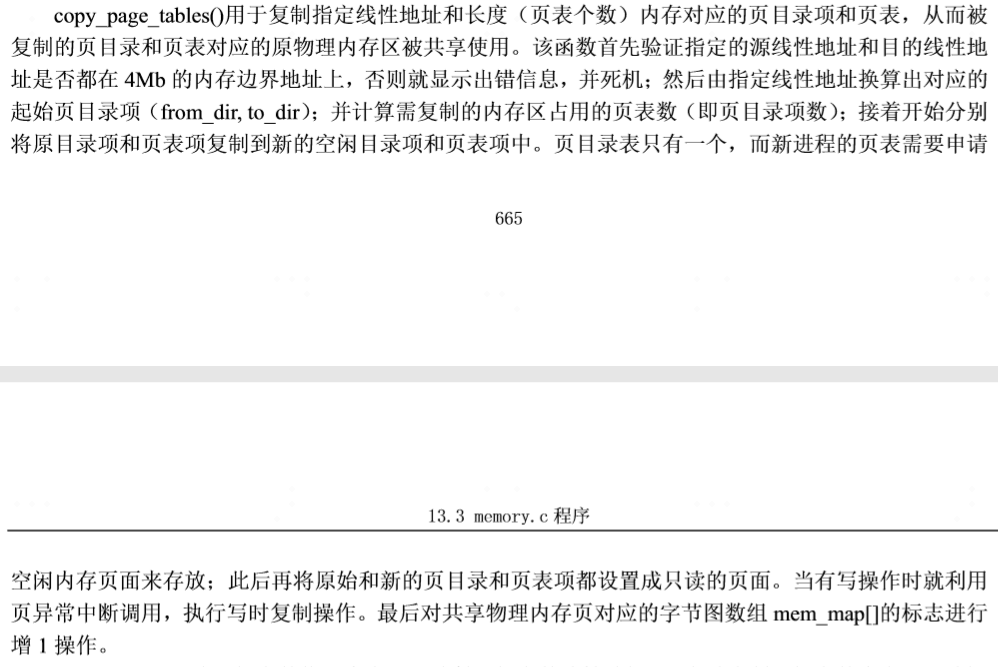

## PCB定义
`/include/linux/sched.h`:
```
struct i387_struct {
	long	cwd;
	long	swd;
	long	twd;
	long	fip;
	long	fcs;
	long	foo;
	long	fos;
	long	st_space[20];	/* 8*10 bytes for each FP-reg = 80 bytes */
};

struct tss_struct {
	long	back_link;	/* 16 high bits zero */
	long	esp0;
	long	ss0;		/* 16 high bits zero */
	long	esp1;
	long	ss1;		/* 16 high bits zero */
	long	esp2;
	long	ss2;		/* 16 high bits zero */
	long	cr3;
	long	eip;
	long	eflags;
	long	eax,ecx,edx,ebx;
	long	esp;
	long	ebp;
	long	esi;
	long	edi;
	long	es;		/* 16 high bits zero */
	long	cs;		/* 16 high bits zero */
	long	ss;		/* 16 high bits zero */
	long	ds;		/* 16 high bits zero */
	long	fs;		/* 16 high bits zero */
	long	gs;		/* 16 high bits zero */
	long	ldt;		/* 16 high bits zero */
	long	trace_bitmap;	/* bits: trace 0, bitmap 16-31 */
	struct i387_struct i387;
};

struct task_struct {
/* these are hardcoded - don't touch */
	long state;	/* -1 unrunnable, 0 runnable, >0 stopped */
	long counter;
	long priority;
	long signal;
	struct sigaction sigaction[32];
	long blocked;	/* bitmap of masked signals */
/* various fields */
	int exit_code;
	unsigned long start_code,end_code,end_data,brk,start_stack;
	long pid,father,pgrp,session,leader;
	unsigned short uid,euid,suid;
	unsigned short gid,egid,sgid;
	long alarm;
	long utime,stime,cutime,cstime,start_time;
	unsigned short used_math;
/* file system info */
	int tty;		/* -1 if no tty, so it must be signed */
	unsigned short umask;
	struct m_inode * pwd;
	struct m_inode * root;
	struct m_inode * executable;
	unsigned long close_on_exec;
	struct file * filp[NR_OPEN];
/* ldt for this task 0 - zero 1 - cs 2 - ds&ss */
	struct desc_struct ldt[3];
/* tss for this task */
	struct tss_struct tss;
};

```

## `fork` 总体流程
- STEP1: 申请存放PCB的内存页(LDT和TSS也存放在该内存页中)：`fork()`首先会为新进程申请一页内存页用来复制父进程的任务数据结构（PCB）信息。
- STEP2：复制并初始化新进程数据：为新进程修改复制的任务数据结构的某些字段值，包括利用系统调用中断发生时逐步压入堆栈的寄存器信息(即`copy_process()`的参数）重新设置任务结构中的 TSS 结构的各字段值，让新进程的状态保持父进程即将进入中断过程前的状态。
- STEP3：确定新进程内存位置：为新进程确定在线性地址空间中的起始位置（nT* 64MB)。对于 CPU 的分段机制，Linux 0.11 的代码段和数据段在线性地址空间中的位置和长度完全相同。
- STEP4：复制页表项：接着系统会为新进程复制父进程的页目录项和页表项。对于 Linux 0.11 内核来说，所有程序共用一个位于物理内存开始位置处的页目录表，而新进程的页表则需另行申请一页内存来存放。
- STEP5：将`LDT`和`TSS`的基址赋给对应的`GDT`表项目。

### Copy On Write
在 `fork()` 的执行过程中，内核并不会立刻为新进程分配代码和数据内存页。**新进程将与父进程共同使用父进程己有的代码和数据内存页面**。只有当以后执行过程中如果其中有一个进程**以写方式访问内存时被访问的内存页面才会在写操作前被复制到新申请的内存页面中**。当页面不再被共享时，仅将该页面不可写改为可写。


### 页面共享相关

> mem_map 的定义为 `static unsigned char mem_map [ PAGING_PAGES ] = {0,};`，其每一个项的值为该页面被多少个应用共享。

#### 共享页面
当每个页面被新的进程共享时，其`mem_map[n]`的值都进行 `+1` ，该操作在`/mm/memory.c`中的`copy_page_tables()`中进行，对应的代码为:
```
...
			if (this_page > LOW_MEM) {
				*from_page_table = this_page;
				this_page -= LOW_MEM;
				this_page >>= 12;
				mem_map[this_page]++;
			}
...
```

#### 共享页面写操作
共享页面写操作会触发页面异常，该异常在`/mm/memory.c`中的`do_wp_page()`中处理（实际是在`un_wp_page`中），通过判断`mem_map[n]`是否等于1 来判断该页面是否被共享，来进行一下两种处理：

- `mem_map[n]==1` : 只将该页面从不可写改为可写。
- `mem_map[n]>1` : 复制该页面的内容到新的物理页面，修改页表项，并将原来的`mem_map[n]`的值减1(表示该页面少了一个共享进程） 。


## Copy Page Tables



